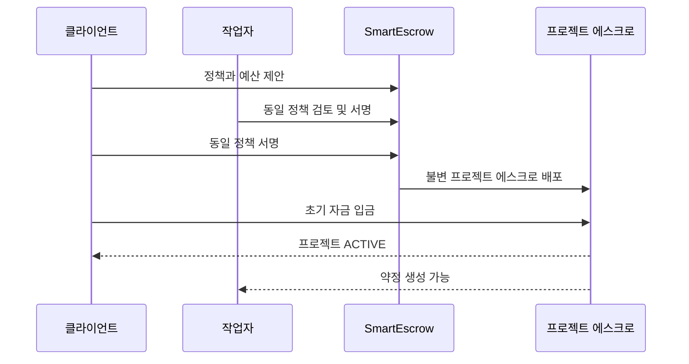
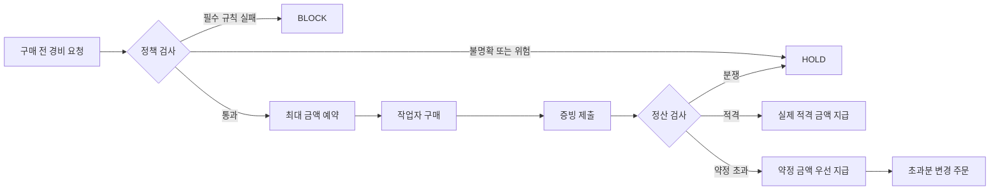
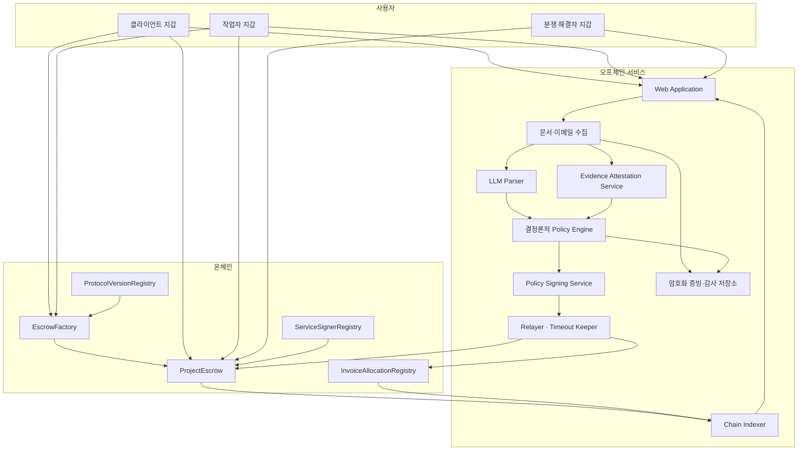
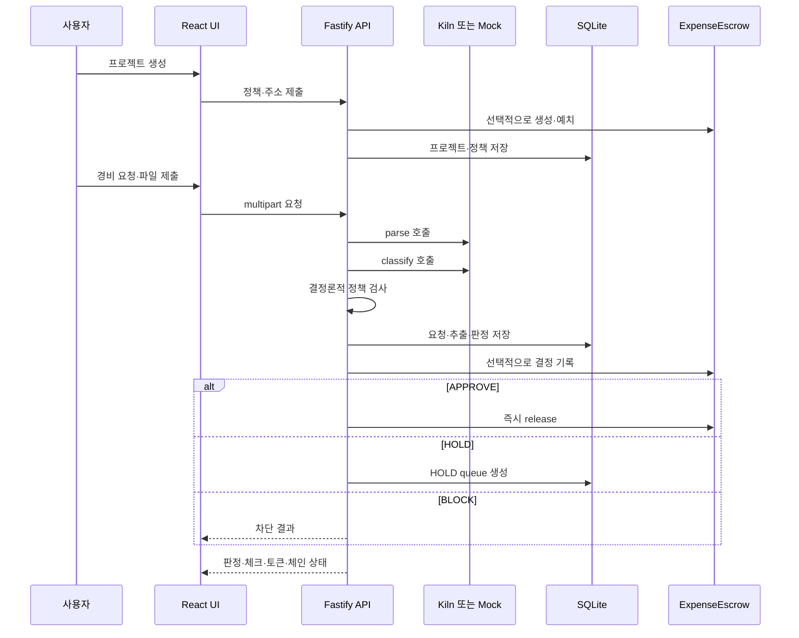

# SmartEscrow: 프로젝트 전체 가이드

> 이 문서는 SmartEscrow를 처음 접한 사람이 제품의 목적, 사용자 흐름, 의사결정 방식, 시스템 구조, 현재 구현, 실행 방법, 한계와 향후 방향까지 한 파일에서 이해할 수 있도록 작성한 통합 안내서입니다.

## 문서에서 사용하는 상태 표기

SmartEscrow 저장소에는 실제로 실행 가능한 데모와 아직 구현되지 않은 목표 프로토콜 설계가 함께 있습니다. 둘을 혼동하지 않도록 아래 표기를 사용합니다.

- **현재 구현:** 이 저장소에서 지금 실행하거나 테스트할 수 있는 기능
- **목표 설계:** ADR로 합의되었지만 구현이 남아 있는 프로토콜 기능

> **중요:** 현재 Solidity 컨트랙트는 Base Sepolia용 레거시 프로토타입입니다. 실제 자금을 보관하거나 운영 서비스의 금융 인프라로 사용하면 안 됩니다.

---

## 목차

1. [프로젝트 한눈에 보기](#1-프로젝트-한눈에-보기)
2. [해결하려는 문제](#2-해결하려는-문제)
3. [사용자와 제공 가치](#3-사용자와-제공-가치)
4. [핵심 개념](#4-핵심-개념)
5. [제품 전체 흐름](#5-제품-전체-흐름)
6. [APPROVE, HOLD, BLOCK 의사결정](#6-approve-hold-block-의사결정)
7. [목표 시스템 아키텍처](#7-목표-시스템-아키텍처)
8. [권한, 신뢰 경계, 보안 모델](#8-권한-신뢰-경계-보안-모델)
9. [증빙, 개인정보, 감사 가능성](#9-증빙-개인정보-감사-가능성)
10. [프로젝트 상태와 자금 회계](#10-프로젝트-상태와-자금-회계)
11. [현재 저장소에 구현된 기능](#11-현재-저장소에-구현된-기능)
12. [데모 시나리오](#12-데모-시나리오)
13. [기술 스택과 저장소 구조](#13-기술-스택과-저장소-구조)
14. [로컬 실행 방법](#14-로컬-실행-방법)
15. [Base Sepolia 연동](#15-base-sepolia-연동)
16. [API 요약](#16-api-요약)
17. [테스트와 검증](#17-테스트와-검증)
18. [현재 한계와 비범위](#18-현재-한계와-비범위)
19. [목표 아키텍처로 가는 구현 순서](#19-목표-아키텍처로-가는-구현-순서)
20. [용어 요약](#20-용어-요약)
21. [자주 묻는 질문](#21-자주-묻는-질문)
22. [문서 체계와 기준](#22-문서-체계와-기준)

---

## 1. 프로젝트 한눈에 보기

SmartEscrow는 외주 프로젝트의 **작업 대금과 프로젝트 경비를 미리 확보하고, 양측이 합의한 조건에 따라 지급하는 양자 간 에스크로 시스템**입니다.

일반적인 외주 거래에서는 작업자가 먼저 일하거나 비용을 지출한 뒤 클라이언트의 승인과 지급을 기다립니다. 반대로 클라이언트는 제출된 청구가 실제 프로젝트 범위에 포함되는지, 중복 청구가 아닌지, 결과물이 합의한 수준인지 확인하기 어렵습니다.

SmartEscrow는 이 문제를 다음 세 단계로 분리합니다.

1. **AI가 해석합니다.** 요청과 문서에서 공급자, 금액, 카테고리, 목적, 이상 신호를 구조화합니다.
2. **결정론적 규칙이 판단합니다.** 합의된 정책에 따라 승인, 검토 보류, 차단을 결정합니다.
3. **스마트 컨트랙트가 집행합니다.** 사전에 고정된 자산, 금액, 수취인, 기한과 상태만 허용합니다.

핵심 문장은 다음과 같습니다.

> **AI는 정보를 해석하지만 돈을 움직일 권한은 갖지 않습니다.**

### 프로젝트의 제품 원칙

- SmartEscrow는 클라이언트만을 위한 지출 감시 도구가 아닙니다.
- 클라이언트는 무단 지출, 범위 밖 청구, 검증되지 않은 납품으로부터 보호받습니다.
- 작업자는 선지출, 미지급, 무기한 검수, 소급 정책 변경, 무상 추가 업무로부터 보호받습니다.
- 한 번 수락된 약정은 어느 한쪽도 일방적으로 다시 쓸 수 없습니다.
- 불확실하거나 실패한 AI 출력은 절대로 자동 승인되지 않습니다.

### 현재 구현과 목표 설계의 차이

| 영역 | 현재 구현 | 목표 설계 |
| --- | --- | --- |
| 제품 형태 | 경비 승인 데모 | 작업 대금과 경비를 함께 보호하는 양자 간 에스크로 |
| 컨트랙트 | 여러 프로젝트를 담는 `ExpenseEscrow` 1개 | 프로젝트별 불변 `ProjectEscrow` |
| 정책 | 백엔드 JSON 정책과 단일 정책 해시 | 양측이 서명한 불변·버전형 정책 |
| 자금 확보 | 프로젝트 전체 예산 일괄 예치 | 경비·마일스톤별 선예약과 부분 입금 |
| 경비 | 지출 후 승인 데모 | 구매 전 약정 → 지출 → 증빙 → 정산 |
| 작업 대금 | 미구현 | 선예치 마일스톤과 기한 기반 검수 |
| HOLD | 클라이언트가 승인 또는 거절 | 유형별 기한, 분쟁 해결자, 결정론적 타임아웃 |
| 환불 | 미구현 | 미예약 잔액 환불과 안전한 종료 |
| 증빙 | SQLite에 텍스트와 해시 저장 | 암호화 오프체인 저장, 온체인 해시 앵커 |
| 공유 비용 | 같은 프로젝트 내 중복 신호 | 프로젝트 간 100% 초과 배분 방지 레지스트리 |
| UI/API | React UI와 Fastify API 구현 | 전체 약정·분쟁·마이그레이션 운영 UI/API |

---

## 2. 해결하려는 문제

### 2.1 작업 대금 미지급과 검수 지연

작업자는 결과물을 제출한 뒤 클라이언트의 응답을 기한 없이 기다릴 수 있습니다. “조금 더 확인하겠다”는 상태가 계속되면 사실상 무기한 지급 보류가 됩니다.

SmartEscrow의 목표 설계에서는 작업 시작 전에 마일스톤 금액을 예약하고, 제출 시점부터 검수 시간이 온체인 기준으로 시작됩니다. 침묵했을 때의 결과도 계약 전에 정합니다.

### 2.2 작업자의 프로젝트 비용 선부담

서버, API, 디자인 도구 같은 비용을 작업자가 먼저 결제하면 환급 여부가 사후 판단에 맡겨집니다.

목표 흐름은 `Reserve → Spend → Settle`입니다. 구매 전에 최대 지급액과 수취인을 확정하고 자금을 예약하므로, 작업자는 승인된 범위 안에서 지출할 수 있습니다.

### 2.3 클라이언트의 통제 부족

클라이언트는 다음을 확인하기 어렵습니다.

- 프로젝트 범위에 포함된 비용인지
- 허용된 공급자와 카테고리인지
- 전체·카테고리·건별 예산을 넘지 않는지
- 이미 제출된 영수증이나 인보이스인지
- 여러 프로젝트에 같은 비용이 100% 넘게 배분되지 않았는지

SmartEscrow는 AI 추출 결과를 그대로 믿지 않고, 버전이 고정된 규칙과 예산 상태를 사용해 다시 검사합니다.

### 2.4 무상 추가 업무와 소급 변경

메신저나 회의에서 추가된 요청은 범위와 가격이 불분명한 채 작업으로 이어지기 쉽습니다. SmartEscrow는 범위 밖 요청을 `OUT_OF_SCOPE`로 분리하고, 양측이 새 범위·가격·일정에 서명하고 추가 금액을 확보한 뒤에만 새 의무로 활성화합니다.

### 2.5 프로젝트 자산 인계

도메인, 저장소, 클라우드 계정, 라이선스는 비용 지급만으로 소유권과 실제 통제권이 이전되지 않습니다. 목표 설계는 자산의 소유자, 임시 관리자, 필요한 인계 증빙과 지급 보류액을 사전에 정의합니다.

---

## 3. 사용자와 제공 가치

### 클라이언트

- 정책 범위, 공급자, 수취인, 예산을 벗어난 지급을 막을 수 있습니다.
- 작업 결과와 비용 증빙을 기준으로 지급할 수 있습니다.
- 중복·이상·초과 청구를 자동 또는 반자동으로 식별할 수 있습니다.
- 프로젝트 종료 시 미사용 자금의 소유권과 환불 경로가 명확합니다.
- 프로젝트 자산과 인계 상태를 추적할 수 있습니다.

### 작업자

- 작업이나 구매를 시작하기 전에 자금 확보 여부를 확인할 수 있습니다.
- 수락된 약정을 클라이언트가 일방적으로 취소하거나 바꿀 수 없습니다.
- 검수와 HOLD에 종료 기한이 생깁니다.
- 클라이언트의 침묵이 영구 미지급으로 이어지지 않습니다.
- 범위 밖 요청을 유료 변경 주문으로 전환할 수 있습니다.

### 분쟁 해결자

- 자유 재량이 아니라 사전에 정의된 기준과 금액 한도 안에서만 판단합니다.
- 지급 수취인 변경, 정책 수정, 약정 금액 증액은 할 수 없습니다.
- 결정은 해당 의무와 이유 코드에 연결되어 감사 기록으로 남습니다.

### 감사자 또는 프로젝트 운영자

- 정책, 증빙 매니페스트, 규칙 결과, 결정, 서명, 지급 이벤트를 연결해 재현할 수 있습니다.
- 원문 증빙을 공개 블록체인에 올리지 않고도 무결성을 확인할 수 있습니다.

---

## 4. 핵심 개념

### 4.1 프로젝트 정책

클라이언트와 작업자가 함께 수락하는 금융·업무 규칙입니다. 목표 정책은 정규화된 JSON으로 관리되며 다음을 포함합니다.

- 참여자와 분쟁 해결자 주소
- 결제 자산과 자릿수
- 프로젝트·경비·마일스톤 예산
- 허용 카테고리, 결제 방식, 공급자, 수취인
- 건별 한도와 프로젝트 기간
- 검수·증빙·분쟁 해결 기한
- 필요한 증빙 수준
- 외화, 세금, 수수료 처리
- 작업 마일스톤과 인수 기준
- 프로젝트 자산과 인계 규칙

목표 설계에서는 정책이 활성화되려면 클라이언트와 작업자가 동일한 정책 해시에 각각 서명해야 합니다. 변경은 기존 문서를 수정하지 않고 새 버전을 만듭니다.

### 4.2 약정과 예약

- **약정(Commitment):** 정해진 조건을 만족하면 지급하겠다는 불변의 약속
- **예약(Reservation):** 약정을 이행하기 위해 다른 요청이 사용할 수 없도록 분리한 자금
- **정산(Settlement):** 조건을 만족한 금액을 고정된 수취인에게 지급하는 행위

약정은 크게 두 종류입니다.

1. **구매 약정:** 프로젝트 경비를 구매 전에 승인하고 최대 정산액을 예약
2. **마일스톤 약정:** 작업 결과와 인수 기준에 연결된 작업 대금을 예약

### 4.3 제출 통지

작업자 또는 청구자가 서명해 온체인에 제출하는 기록입니다. 무엇을 언제 제출했는지 고정하고 검수 시계를 시작합니다. 이후 증빙 서비스나 백엔드가 느려져도 제출 시점을 뒤로 미룰 수 없습니다.

### 4.4 증빙 수준

| 수준 | 예시 | 의미 |
| --- | --- | --- |
| E0 | 자연어 주장만 존재 | 독립 문서 증빙 없음 |
| E1 | PDF, 이미지, 스크린샷 | 파일은 보존되지만 발급처는 인증되지 않음 |
| E2 | 도메인 정렬을 포함한 DKIM 검증을 통과한 원본 이메일 | 서명 도메인이 보존된 메시지 내용을 인증 |
| E3 | 공급자 API 기록 또는 공급자 서명 자격증명 | 승인된 연동으로 공급자 원본을 검증 |

증빙 수준은 승인 여부를 단독으로 결정하지 않습니다. 높은 수준의 증빙도 프로젝트 관련성, 예산, 배분 규칙을 별도로 통과해야 합니다.

---

## 5. 제품 전체 흐름

이 절은 **목표 설계**의 완성된 사용자 여정을 설명합니다.

### 5.1 프로젝트 시작

1. 클라이언트와 작업자가 참여 주소, 결제 자산, 예산, 마일스톤, 경비 규칙, 기한, 증빙, 분쟁 해결자, 자산 인계 규칙을 정합니다.
2. 시스템이 정규화된 프로젝트 정책을 생성합니다.
3. 양측이 같은 정책 해시에 서명합니다.
4. 서명된 정책에 포함된 예측 주소로 프로젝트 전용 에스크로를 배포합니다.
5. 클라이언트가 정책상 필요한 초기 자금을 입금합니다.
6. 서명과 자금 조건이 모두 충족되면 프로젝트가 `ACTIVE`가 됩니다.



### 5.2 작업 마일스톤

1. 작업 범위, 인수 기준, 납기, 단위별 금액을 정책에 정의합니다.
2. 클라이언트가 마일스톤 최대 금액을 예치·예약합니다.
3. 작업자는 `FUNDED_AND_RESERVED` 상태를 확인한 뒤 작업을 시작합니다.
4. 완료 후 결과물과 증빙 매니페스트를 묶은 제출 통지를 보냅니다.
5. 클라이언트가 사전 정의된 기준으로 승인하거나 이유 코드와 함께 이의를 제기합니다.
6. 승인은 즉시 지급되고, 이의는 분쟁 해결 절차로 이동합니다.
7. 클라이언트가 침묵하면 검증된 제출 단위가 사전 합의된 규칙에 따라 지급됩니다.

부분 지급은 사전에 분리된 납품 단위와 고정 금액에 대해서만 가능합니다. 검수 단계에서 새 기준을 추가하거나 임의의 “공정한 금액”을 정할 수 없습니다.

### 5.3 경비 구매와 환급

기본 흐름은 구매 전에 지급 가능성을 확정하는 것입니다.



실제 적격 비용이 예약액보다 작으면 실제 비용만 지급하고 나머지를 가용 예산으로 돌립니다. 예약액을 넘으면 약속된 금액은 먼저 지급하고 초과분만 별도 변경 주문으로 처리합니다.

구매 전에 약정하지 않은 경비는 `RETROACTIVE_REQUEST`입니다. 명시적 승인은 가능하지만 클라이언트의 침묵만으로 지급 권리가 생기지는 않습니다.

### 5.4 공급자 직접 지급

정책이 허용하면 작업자 환급 대신 공급자에게 직접 지급할 수 있습니다.

- 구매 전에 공급자 신원, 수취 주소, 정확한 금액과 견적을 고정합니다.
- 에스크로가 고정된 공급자 주소로 직접 지급합니다.
- 사후 영수증은 감사 기록을 정리하기 위한 것이며 두 번째 지급 승인이 아닙니다.
- 영수증이 끝내 확인되지 않으면 지급을 되돌리지 않고 `DIRECT_PAID_UNRECONCILED` 상태로 남깁니다.
- 미정산 상태에서는 같은 공급자에 대한 후속 직접 지급을 제한합니다.

### 5.5 HOLD와 분쟁

모든 HOLD에는 유형, 클라이언트 응답 기한, 분쟁 해결 기한, 최종 대체 결과가 있습니다. 유효한 사전 약정에 대한 클라이언트의 거절은 즉시 최종 거절이 아니라 분쟁 시작 신호입니다.

### 5.6 범위 변경

1. 현재 요청을 `OUT_OF_SCOPE`로 표시합니다.
2. AI가 추가 범위, 가격, 일정, 인수 기준을 담은 변경 주문 초안을 만들 수 있습니다.
3. 양측이 내용을 검토하고 새 정책 버전에 서명합니다.
4. 추가 자금을 예치·예약합니다.
5. 그 이후에만 새 작업 또는 경비 권한이 활성화됩니다.

이전 약정은 생성 당시 고정한 정책 버전을 계속 사용합니다.

### 5.7 공유 인보이스 배분

하나의 구독이나 인프라 비용을 여러 프로젝트가 나눌 수 있습니다.

- 증빙 서비스가 민감한 인보이스 원문 대신 불투명한 `invoiceNullifier`를 발급합니다.
- 프로젝트 A가 40%, 프로젝트 B가 60%를 예약할 수 있습니다.
- 이후 총합을 100%보다 크게 만드는 배분은 온체인에서 원자적으로 거절됩니다.
- 공개 레지스트리는 공급자, 인보이스 번호, 고객, 원문 금액을 저장하지 않습니다.

MVP 목표는 인보이스 전체 단위 배분만 지원하며 행 단위 배분은 비범위입니다.

### 5.8 프로젝트 자산 인계

각 약정은 다음 중 하나의 자산 처리 유형을 가집니다.

- `CONSUMABLE`: 사용 후 이전할 자산이 없는 비용
- `PROJECT_ASSET`: 클라이언트가 실질 소유하고 작업자가 임시 관리할 수 있는 자산
- `CONTRACTOR_TOOL`: 작업자 소유 도구의 합의된 사용분
- `SHARED_ASSET`: 여러 프로젝트가 함께 사용하는 자산

프로젝트 자산은 소유자, 현재 관리자, 외부 공급자, 갱신일, 인계 증빙, 인계 기한과 지급 보류액을 미리 정합니다. 외부 계정 이전과 블록체인 지급은 하나의 원자적 트랜잭션이 될 수 없으므로, SmartEscrow는 검증된 인계 확인서를 소비하면서 보류액을 지급합니다.

### 5.9 종료와 환불

어느 참여자든 종료를 시작할 수 있습니다. `CLOSING` 상태에서는 새 약정을 만들 수 없지만 기존 약정, 분쟁, 인계는 계속 처리됩니다. 클라이언트는 예약되지 않은 금액만 환불받을 수 있습니다.

모든 의무와 자산 인계가 종결되고 환불 가능 잔액이 반환되면 프로젝트가 `CLOSED`가 됩니다.

### 5.10 보안 사고와 마이그레이션

보안 사고 시 관리자 멀티시그는 제한된 기간 동안 자금 이동을 동결할 수 있습니다. 동결은 의무를 취소하지 않고 관련 기한을 동결 시간만큼 연장합니다.

안전한 재개가 기록되지 않으면 시스템은 일방향 `RECOVERY_ONLY` 모드로 전환합니다. 이 상태에서는 새 의무를 만들 수 없지만 참여자가 제한된 정산, 가용 자금 회수, 안전한 새 컨트랙트로의 양자 합의 마이그레이션을 수행할 수 있습니다.

---

## 6. APPROVE, HOLD, BLOCK 의사결정

### 기본 결과

| 결과 | 의미 | 자금 효과 |
| --- | --- | --- |
| `APPROVE` | 필수 규칙을 통과했고 미해결 위험이 없음 | 현재 데모에서는 즉시 지급, 목표 설계에서는 요청 유형에 따라 예약 또는 정산 |
| `HOLD` | 증빙, 위험, 비즈니스 검토 또는 시스템 문제가 남음 | 자동 지급하지 않고 정해진 절차와 기한으로 이동 |
| `BLOCK` | 필수 결정론적 규칙이 실패함 | 의무 생성 또는 정산 불가 |

AI가 `APPROVE`를 직접 결정하지 않습니다. AI는 구조화된 필드와 위험 신호를 제안하고, 정책 엔진이 다음 순서로 검사합니다.

1. 신원과 무결성
2. 프로젝트 상태
3. 범위, 카테고리, 결제 방식, 공급자, 수취인
4. 거래·카테고리·프로젝트 예산과 예약 가능액
5. 증빙 수준과 필수 필드
6. 중복, 배분 충돌, 가격 이상, 분할 청구 등 위험 신호

### 목표 HOLD 유형과 타임아웃

| HOLD 유형 | 사용 조건 | 최종 방향 |
| --- | --- | --- |
| `CLIENT_REVIEW` | 객관적 실패 없이 비즈니스 검토 또는 클라이언트 이의가 필요 | 침묵 시 약정된 적격 금액 지급 |
| `POLICY_OR_SYSTEM_AMBIGUITY` | 적시 제출은 완전하지만 파서·정책 엔진·증빙 서비스 결과가 불명확하거나 사용 불가 | 분쟁 해결 후, 해결자도 침묵하면 청구액과 약정 한도 중 작은 금액 지급 |
| `EVIDENCE_DEFECT` | 증빙 누락·손상·지연 또는 금액·수취인 확인 실패 | 보완 또는 분쟁 해결, 끝내 해결되지 않으면 거절 |
| `INTEGRITY_RISK` | 서명 문제, 유력한 중복, 근거 있는 사기 신호 | 분쟁 해결, 해결되지 않으면 거절 |
| `EXCESS_AMOUNT` | 적격 실제 비용이 약정 상한을 초과 | 약정분은 지급하고 초과분은 양자 변경 주문 필요 |

정확히 같은 인보이스의 새 배분이 100%를 초과하는 경우는 HOLD가 아니라 새 요청의 `BLOCK`입니다.

---

## 7. 목표 시스템 아키텍처



### 구성 요소 책임

| 구성 요소 | 책임 | 자금 보관 |
| --- | --- | --- |
| Web Application | 정책 작성, 요청 제출, 상태·기한·트랜잭션 표시 | 아니요 |
| 문서·이메일 수집 | 파일 보존, 텍스트 추출, 원본 이메일 수집 | 아니요 |
| LLM Parser | 자연어와 문서를 구조화된 필드로 변환 | 아니요 |
| Policy Engine | 버전 고정 정책을 결정론적으로 평가 | 아니요 |
| Evidence Attestation Service | 증빙 슬롯, 보증 수준, 결함, 인보이스 nullifier 확인 | 아니요 |
| Policy Signing Service | 유효한 평가 결과에만 제한된 서비스 서명 | 아니요 |
| Relayer / Keeper | 이미 승인된 페이로드와 타임아웃 트랜잭션 제출 | 아니요 |
| 암호화 저장소 | 원문 증빙과 결정 번들 보관 | 아니요 |
| Chain Indexer | 이벤트를 UI용 조회 모델로 재구성 | 아니요 |
| `EscrowFactory` | 승인된 불변 버전으로 프로젝트 에스크로 배포 | 아니요 |
| `ProjectEscrow` | 한 프로젝트의 자금, 의무, 기한, 환불 강제 | 예 |
| `ServiceSignerRegistry` | 서비스 키와 epoch 게시 | 아니요 |
| `InvoiceAllocationRegistry` | 인보이스 배분 총합 100% 제한 | 아니요 |
| `ProtocolVersionRegistry` | 지원 버전과 폐기 공지 | 아니요 |

프로젝트별 독립 에스크로를 사용하므로 한 프로젝트의 회계 오류나 분쟁이 다른 프로젝트의 자금을 소비할 수 없습니다. 공유 컨트랙트는 프로젝트 자금을 보관하지 않습니다.

---

## 8. 권한, 신뢰 경계, 보안 모델

### 8.1 권한 분리

| 역할 | 할 수 있는 일 | 할 수 없는 일 |
| --- | --- | --- |
| 클라이언트 | 입금, 정책 공동 수락, 새 약정 일시정지, HOLD 검토, 종료 시작 | 수락된 약정 취소, 지급 주소 변경, 무기한 지급 보류 |
| 작업자 | 정책 공동 수락, 약정 요청, 증빙 제출, 미사용 예약 취소, 분쟁·종료 시작 | 자금 직접 해제, 약정 증액, 수취인 변경 |
| LLM | 필드 추출과 분류 제안 | 서명, 승인, 지급, 분쟁 결정 |
| 정책 엔진 | 버전형 규칙 실행과 결과 추적 | AI 결과로 필수 규칙 무시 |
| 정책 서명자 | 검증된 결과에 제한된 서명 | 평가 후 필드 수정, 관리자 행위 |
| 증빙 확인자 | 증빙 강도와 결함, nullifier 확인 | 제출 시계 변경, 수취인 선택, 금액 증액 |
| 릴레이어 | 서명된 트랜잭션 제출과 가스 대납 | 서명 내용 변경 또는 새 권한 생성 |
| 분쟁 해결자 | 기존 의무와 분쟁 금액 안에서 결정 | 수취인 변경, 금액 상한 초과, 정책 수정 |
| 관리자 | 서비스 키 교체, 제한된 보안 동결 | 프로젝트 자금 인출, 상업 분쟁 해결 |
| 에스크로 | 서명, 상태, 금액, 기한, 예약, 재사용 방지 강제 | 자연어 또는 문서 의미 해석 |

### 8.2 서명과 재사용 방지

목표 금융 페이로드는 최소한 다음 값을 고정합니다.

- 프로젝트와 의무 식별자
- 정책 해시와 버전
- 체인 ID와 검증 컨트랙트
- 결제 자산과 수취인
- 정확한 금액 또는 최대 금액
- 증빙 매니페스트 해시
- nonce와 만료 시각

EIP-712 형식 서명을 사용하며 스마트 계정은 EIP-1271을 지원합니다. nonce는 한 번만 소비되고, 릴레이어는 서명된 값을 바꿀 수 없습니다.

### 8.3 실패 시 기본 동작

| 장애 | 기대 동작 |
| --- | --- |
| AI 오류 또는 잘못된 JSON | HOLD 또는 무결정, 절대 자동 승인하지 않음 |
| 정책 엔진 장애 | 적시 제출을 보존하고 기한이 있는 분쟁 경로로 이동 |
| 릴레이어 장애 | 사용자나 다른 릴레이어가 동일한 서명 페이로드 제출 가능 |
| 증빙 서비스 장애 | 제출 시각과 예약은 보존, 시스템 모호성 경로 적용 |
| 인덱서 장애 | UI는 저하되지만 컨트랙트 상태는 유지 |
| 토큰 전송 실패 | 회계와 상태 변경 전체 되돌림 |
| 서비스 키 침해 | 키 교체와 제한된 보안 동결, 기존 의무 보존 |
| 컨트랙트 결함 | 안전한 재개 또는 `RECOVERY_ONLY`, 이후 양자 마이그레이션 |

### 8.4 명시적 신뢰 가정

목표 MVP도 완전한 무신뢰 시스템은 아닙니다.

- 정책 서명 서비스가 유효한 평가에만 서명한다고 신뢰합니다.
- 분쟁 해결자가 사전 기준과 금액 한도 안에서 판단한다고 신뢰합니다.
- 증빙 확인 서비스가 인보이스를 일관되게 정규화하고 nullifier를 발급한다고 신뢰합니다.
- MockUSDC는 실제 달러나 규제된 스테이블코인이 아닙니다.

이 역할들은 자금을 임의 주소로 보내거나 약정을 증액하거나 정책을 바꾸거나 프로젝트 잔액을 인출할 수 없도록 제한하는 것이 목표입니다.

---

## 9. 증빙, 개인정보, 감사 가능성

### 저장 원칙

목표 설계에서는 인보이스, 영수증, 이메일, 계정 정보, 개인 정보와 저장 URL을 공개 체인에 기록하지 않습니다.

- 원문: 프로젝트별 권한과 암호화를 적용한 오프체인 저장소
- 온체인: 비민감 식별자, 정책·증빙·결정 번들의 암호학적 해시
- 로그: 원문 문서, 이메일 본문, 자격증명 제외
- 삭제: 법적으로 가능한 경우 암호화된 객체와 키 삭제, 온체인 해시는 잔존

### 감사 가능한 기록

하나의 지급을 재현하려면 다음이 연결되어야 합니다.

1. 양측이 수락한 정책 버전
2. 구매 또는 마일스톤 약정
3. 제출 통지와 온체인 제출 시각
4. 증빙 매니페스트와 원문 해시
5. AI가 추출한 구조화 필드
6. 결정론적 규칙 결과와 위험 신호
7. HOLD·분쟁·타임아웃 결과
8. 정확한 자산, 수취인, 금액을 포함한 정산 이벤트

모델의 비공개 사고 과정은 감사 근거로 저장하지 않습니다. 대신 검증된 입력과 출력, 모델·파서·정책 엔진 버전, 안정적인 이유 코드와 토큰 사용량을 기록합니다.

> **현재 구현 차이:** 데모 백엔드는 요청 텍스트와 추출한 문서 텍스트를 로컬 SQLite에 평문으로 저장합니다. 암호화 객체 저장소, 접근 제어, 보존 정책과 E2/E3 확인은 아직 구현되지 않았습니다.

---

## 10. 프로젝트 상태와 자금 회계

### 목표 프로젝트 상태

```text
DRAFT → ACTIVE → CLOSING → CLOSED
   └────────────→ CANCELLED
```

| 상태 | 의미 |
| --- | --- |
| `DRAFT` | 정책 서명 또는 초기 자금이 미완료 |
| `ACTIVE` | 새 약정 생성, 제출, 정산, 정책 변경 가능 |
| `CLOSING` | 새 약정 금지, 기존 의무·분쟁·인계 처리와 잔액 환불 |
| `CLOSED` | 모든 의무와 환불 종료, 읽기 전용 |
| `CANCELLED` | 활성 의무가 없는 초안 또는 양자 취소 프로젝트 |

클라이언트의 `newCommitmentsPaused`는 프로젝트 상태와 별도입니다. 일시정지는 새 약정만 막고 기존 약정의 제출, 검수, 정산 기한은 계속 진행합니다.

### 목표 회계 모델

```text
released  = expenseReleased + milestoneReleased
available = funded
          - expenseReserved
          - milestoneReserved
          - released
          - refunded
          - migratedOut
```

- `funded`: 클라이언트가 정상 입금 경로로 넣은 누적 원금
- `expenseReserved`: 구매 약정에 묶인 금액
- `milestoneReserved`: 작업 약정에 묶인 금액
- `expenseReleased`: 경비로 지급된 누적 금액
- `milestoneReleased`: 작업 대금으로 지급된 누적 금액
- `refunded`: 클라이언트에게 반환된 누적 금액
- `migratedOut`: 새 에스크로로 이전된 최종 가용 잔액
- `available`: 새 약정 또는 종료 환불에 사용할 수 있는 금액

모든 금액은 결제 토큰의 최소 단위 정수입니다. 부동소수점 금액은 목표 금융 페이로드에서 허용하지 않습니다.

---

## 11. 현재 저장소에 구현된 기능

현재 저장소는 **Phase 1 컨트랙트 + Phase 2 백엔드 + Phase 3 데모 UI**로 구성됩니다.

### 11.1 현재 요청 처리 흐름



### 11.2 AI 해석 파이프라인

현재 백엔드는 경비 요청마다 두 종류의 모델 호출을 사용합니다.

1. `parse`: 공급자, 카테고리, 금액, 통화, 목적, 관련성, 문서 유형, 이상 신호를 JSON으로 추출
2. `classify`: 프로젝트 관련성과 이상 신호를 정책 문맥에서 다시 분류

각 결과는 엄격한 런타임 스키마 검증을 거칩니다. JSON이 잘못되면 검증 오류를 포함해 한 번 다시 요청합니다. 두 번 모두 실패하면 다음 안전 기본값을 적용합니다.

- 결과: `HOLD`
- 이유: `AI output invalid; held for review`
- 자동 지급: 없음

현재 문서 처리는 텍스트 파일 내용의 앞 12,000자를 읽습니다. 바이너리 파일은 파일명과 크기만 모델 문맥에 표시되며 OCR 또는 PDF 파싱은 구현되어 있지 않습니다.

### 11.3 현재 결정론적 정책 검사

| 검사 | 실패 결과 | 설명 |
| --- | --- | --- |
| 프로젝트 관련성 | `BLOCK` | AI 관련성이 `low`인지 확인 |
| 허용 카테고리 | `BLOCK` | 정책 allowlist에 포함되는지 확인 |
| 승인 공급자 | `BLOCK` | 정책 allowlist에 포함되는지 확인 |
| 남은 프로젝트 예산 | `BLOCK` | 승인되었거나 보류 중인 금액과 새 금액이 전체 예산을 넘는지 확인 |
| 카테고리 예산 | `BLOCK` | 카테고리별 상한을 넘는지 확인 |
| 건별 최대 금액 | `BLOCK` | `max_transaction` 초과 여부 확인 |
| 프로젝트 기한 | `BLOCK` | 정책 종료일이 지났는지 확인 |
| 중복 증빙 | `HOLD` | 같은 파일 해시 또는 인보이스 번호가 있는지 확인 |
| 이상 가격 | `HOLD` | 모델 신호 또는 카테고리 대표값의 3배 초과 여부 확인 |
| 기타 이상 신호 | `HOLD` | 분할 청구 등 추가 검토 필요 |
| 통화 불일치 | `BLOCK` | 추출 통화와 정책 통화 비교 |

강한 규칙 실패가 하나라도 있으면 첫 실패 이유로 `BLOCK`합니다. 강한 실패가 없고 중복 또는 이상 신호가 있으면 `HOLD`, 모두 통과하면 `APPROVE`입니다.

### 11.4 현재 데모 정책

```json
{
  "project_budget": 1000,
  "currency": "USD",
  "allowed_categories": ["Cloud", "AI API", "Design Software"],
  "allowed_vendors": ["AWS", "OpenAI", "Figma", "Adobe"],
  "category_budget": {
    "Cloud": 1000,
    "AI API": 1000,
    "Design Software": 1000
  },
  "max_transaction": 400,
  "deadline": "2026-12-31",
  "typical_amount": {
    "Cloud": 250,
    "AI API": 100,
    "Design Software": 150
  }
}
```

현재 정책 금액은 API와 SQLite에서 미국 달러 숫자로 다루고, 체인에 쓸 때 `1 USD = 1,000,000 MockUSDC base units`로 변환합니다. 이는 목표 아키텍처의 “모든 금액을 처음부터 정수 base unit으로 표현”하는 방식과 다릅니다.

### 11.5 현재 백엔드

Fastify 기반 API는 다음을 제공합니다.

- 프로젝트 생성과 정책 해시 저장
- JSON 또는 multipart 경비 제출
- Kiln 실호출과 고정 fixture 기반 mock 모드
- SQLite 영속화
- APPROVE/HOLD/BLOCK 평가
- HOLD 승인·거절
- 프로젝트 중지
- 지출 현황과 정산 목록
- Server-Sent Events 기반 결정 갱신
- Kiln/mock 호출별 토큰 지표
- 선택적 Base Sepolia 쓰기

SQLite에는 프로젝트, 정책, 경비 요청, AI 추출, 결정, HOLD queue, 정산, LLM 호출 정보가 저장됩니다.

### 11.6 현재 프론트엔드

Vite + React 단일 페이지 UI는 다음 기능을 제공합니다.

- 백엔드·모델·체인 연결 상태 표시
- 프로젝트 이름, 클라이언트 주소, 수취인 주소, 정책 JSON 입력
- 데모 정책 자동 입력
- 텍스트와 파일을 포함한 경비 요청
- 네 가지 데모 요청 버튼
- 추출 결과, 규칙별 통과 여부, 최종 판정 표시
- HOLD queue 승인·거절
- 예산, 지급액, 보류액, 잔액 표시
- 프로젝트 중지
- Kiln과 mock 토큰 사용량 분리 표시
- 유효한 트랜잭션 해시의 Base Sepolia Basescan 링크

현재 프로젝트 ID는 브라우저 `localStorage`에 보관됩니다.

### 11.7 현재 Solidity 컨트랙트

`ExpenseEscrow.sol`은 여러 프로젝트를 한 컨트랙트에서 관리하는 레거시 데모입니다.

| 함수 | 호출 주체 | 동작 |
| --- | --- | --- |
| `createProject` | 누구나 | 호출자를 클라이언트로 기록하고 정책 해시·예산 생성 |
| `deposit` | 해당 클라이언트 | 아직 입금하지 않은 전체 예산을 한 번에 예치 |
| `recordDecision` | 에이전트 | 판정, 금액, 증빙 해시, 정책 해시, 수취인 기록 |
| `approveHold` | 클라이언트 | HOLD를 지급 가능 상태로 전환 |
| `rejectHold` | 클라이언트 | HOLD를 최종 비지급 상태로 전환 |
| `release` | 에이전트 | 기록된 수취인과 금액이 일치할 때 지급 |
| `stopProject` | 클라이언트 | 이후 기록, 지급, 입금, HOLD 처리를 모두 중지 |
| `setAgent` | 배포자 | 백엔드 에이전트 주소 교체 |

컨트랙트는 다음을 강제합니다.

- 에이전트와 클라이언트 권한
- 정책 해시 일치
- 동일 프로젝트·증빙 조합의 중복 결정 금지
- 예산과 입금액을 넘는 지급 금지
- APPROVE 또는 클라이언트가 승인한 HOLD만 지급
- 결정 기록 시 고정한 수취인 외 주소로 지급 금지
- 재진입 방지

하지만 다음은 강제하지 않습니다.

- 카테고리, 공급자, 프로젝트 범위, 중복 문서 정책
- 구매 전 예약
- 마일스톤
- 검수 기한과 자동 타임아웃
- 중지 이후 환불
- 프로젝트별 컨트랙트 격리
- 양측 정책 서명과 버전 변경
- 분쟁 해결자와 자산 인계

`stopProject` 이후에는 미사용 토큰을 꺼낼 방법이 없습니다. 따라서 실제 자금에 사용해서는 안 됩니다.

### 11.8 현재 체인 연동 동작

체인 환경 변수가 모두 설정되면 백엔드는 `viem`을 사용합니다.

- 프로젝트 생성 시 MockUSDC를 클라이언트 주소에 mint
- 클라이언트 키로 토큰 approve, 프로젝트 생성, 전체 예산 예치
- 에이전트 키로 결정 기록
- APPROVE는 기록 직후 에이전트가 지급
- HOLD는 클라이언트 키가 승인한 뒤 에이전트가 지급
- BLOCK은 기록만 하고 지급하지 않음
- 각 쓰기는 트랜잭션 영수증의 성공 상태를 기다림

체인 주소나 키가 하나라도 없으면 `DisabledChain`으로 실행되며 데이터는 SQLite에 저장되고 응답의 체인 상태는 `skipped`가 됩니다.

---

## 12. 데모 시나리오

UI의 네 가지 버튼으로 핵심 판정을 확인할 수 있습니다.

| 케이스 | 요청 | 기대 결과 | 이유 |
| --- | --- | --- | --- |
| 1 | AWS 서버 비용 $200 | `APPROVE` | 허용 공급자·카테고리·건별 한도 통과 |
| 2 | 게임 콘솔 $300 | `BLOCK` | 프로젝트 범위 또는 허용 카테고리·공급자 위반 |
| 3 | AWS 서버 비용 $500 | `BLOCK` | 건별 한도 $400 초과 |
| 4 | AWS 인보이스 #1023, $200 | 첫 제출은 통과 가능 | 정책 위반이 없으면 승인 |
| 4 반복 | 같은 파일 또는 인보이스 #1023 재제출 | `HOLD` | 중복 가능성 검토 필요 |

실행 순서:

1. 백엔드와 프론트엔드를 시작합니다.
2. UI에서 기본 정책으로 프로젝트를 생성합니다.
3. 케이스 버튼을 눌러 요청을 제출합니다.
4. Decision 표에서 각 정책 검사를 확인합니다.
5. HOLD 항목은 queue에서 승인 또는 거절합니다.
6. 체인 모드라면 record/release 트랜잭션을 Basescan에서 확인합니다.
7. Token metrics에서 실제 Kiln과 mock 데이터를 구분합니다.

Mock fixture의 토큰 수는 실제 Kiln 사용 증거가 아닙니다.

---

## 13. 기술 스택과 저장소 구조

### 기술 스택

| 영역 | 기술 |
| --- | --- |
| 스마트 컨트랙트 | Solidity 0.8.24 |
| 컨트랙트 개발·테스트 | Foundry, forge-std |
| 데모 네트워크 | Base Sepolia, chain ID 84532 |
| 데모 토큰 | 6 decimals의 공개 mint형 MockUSDC |
| 백엔드 | Node.js, TypeScript, Fastify |
| 데이터베이스 | SQLite, better-sqlite3, WAL mode |
| 블록체인 클라이언트 | viem |
| AI | Kiln의 `qwen3-32b` 또는 로컬 fixture mock |
| 프론트엔드 | React 19, Vite 7, TypeScript |
| 실시간 갱신 | Server-Sent Events |

### 저장소 구조

```text
smartescrow/
├─ src/
│  ├─ ExpenseEscrow.sol       # 레거시 다중 프로젝트 경비 에스크로
│  └─ MockUSDC.sol            # Base Sepolia 데모 토큰
├─ test/
│  └─ ExpenseEscrow.t.sol     # 컨트랙트 단위 테스트
├─ script/
│  └─ Deploy.s.sol            # Base Sepolia 전용 배포 스크립트
├─ backend/
│  ├─ src/ai/                 # AI 프롬프트, JSON 추출, 스키마 검증
│  ├─ src/policy/             # 정책 타입과 결정론적 엔진
│  ├─ src/chain/              # 비활성·메모리·viem 체인 어댑터
│  ├─ src/kiln/               # live와 mock Kiln 클라이언트
│  ├─ src/app.ts              # HTTP API
│  ├─ src/service.ts          # 요청 처리 오케스트레이션
│  └─ src/db.ts               # SQLite 스키마와 조회
├─ frontend/
│  └─ src/                    # React 데모 UI와 API 클라이언트
├─ docs/
│  ├─ adr/                    # 목표 아키텍처의 권위 있는 결정 기록
│  ├─ product-overview.md
│  ├─ how-it-works.md
│  ├─ system-architecture.md
│  ├─ terminology.md
│  └─ kiln-notes.md
├─ .env.example               # 실행 환경 변수 예시
├─ DECISIONS.md               # 현재 레거시 구현 선택 기록
└─ foundry.toml               # Solidity 컴파일 설정
```

---

## 14. 로컬 실행 방법

### 사전 준비

- Git과 서브모듈
- Node.js와 npm
- Foundry (`forge`)
- 선택 사항: Kiln API 키
- 선택 사항: Base Sepolia RPC, 테스트 ETH, 배포 주소와 테스트용 개인 키

### 14.1 저장소 의존성 준비

서브모듈이 비어 있다면 다음을 실행합니다.

```powershell
git submodule update --init --recursive
```

백엔드와 프론트엔드 의존성을 설치합니다.

```powershell
cd backend
npm install
cd ..\frontend
npm install
cd ..
```

### 14.2 환경 변수

루트에서 예시 파일을 복사합니다.

```powershell
Copy-Item .env.example .env
```

가장 간단한 로컬 데모는 기본값인 다음 조합입니다.

```dotenv
KILN_MODE=mock
PORT=3010
DATABASE_PATH=backend/data/smartescrow.db
```

이 경우 Kiln 네트워크 호출과 블록체인 쓰기는 필요하지 않습니다.

실제 Kiln 호출을 사용하려면 다음을 설정합니다.

```dotenv
KILN_BASE_URL=https://api.bricksum.com/v1
KILN_API_KEY=sk-bk-...
KILN_MODEL=qwen3-32b
KILN_MODE=live
```

서버는 첫 모델 호출 전에 `GET /models`에서 설정한 모델 ID가 실제 제공되는지 확인하며, 임의의 다른 모델로 조용히 대체하지 않습니다.

### 14.3 테스트

```powershell
forge test
cd backend
npm test
cd ..\frontend
npm run build
```

### 14.4 API 실행

첫 번째 터미널:

```powershell
cd backend
npm run dev
```

기본 주소는 `http://localhost:3010`입니다.

### 14.5 UI 실행

두 번째 터미널:

```powershell
cd frontend
npm run dev
```

브라우저에서 `http://localhost:5173`을 엽니다. Vite가 `/api` 요청을 3010번 포트의 백엔드로 전달합니다.

### 14.6 초기화

로컬 데이터는 기본적으로 `backend/data/smartescrow.db`에 저장됩니다. 새 데모가 필요하면 서버를 종료한 후 이 파일을 별도로 백업하거나 제거하고 다시 시작합니다. 기존 데이터가 필요한 경우 삭제하지 마세요.

---

## 15. Base Sepolia 연동

### 15.1 레거시 컨트랙트 배포

> 아래 배포는 현재 데모를 재현하기 위한 용도입니다. 실제 자금을 사용하지 마세요.

배포 키에는 Base Sepolia 테스트 ETH가 필요합니다.

```powershell
$env:ESCROW_AGENT="0xYourBackendSigner"
$env:PRIVATE_KEY="0xYourDeployPrivateKey"

forge script script/Deploy.s.sol:Deploy `
  --rpc-url base_sepolia `
  --private-key $env:PRIVATE_KEY `
  --broadcast
```

배포 스크립트는 chain ID가 84532가 아니면 중단합니다. 배포자는 컨트랙트 owner가 되며 `setAgent`로 에이전트 주소를 교체할 수 있습니다.

### 15.2 백엔드 체인 설정

배포 결과와 테스트 키를 `.env`에 설정합니다.

```dotenv
RPC_URL=https://sepolia.base.org
CHAIN_ID=84532
ESCROW_ADDRESS=0x...
USDC_ADDRESS=0x...
AGENT_PRIVATE_KEY=0x...
CLIENT_PRIVATE_KEY=0x...
```

- `AGENT_PRIVATE_KEY` 주소는 배포 시 설정한 `ESCROW_AGENT`와 같아야 합니다.
- UI에서 입력하는 클라이언트 주소는 `CLIENT_PRIVATE_KEY`에서 파생된 주소와 같아야 합니다.
- 현재 백엔드는 테스트 편의를 위해 프로젝트 생성 시 공개 mint형 MockUSDC를 발행합니다.
- 개인 키는 브라우저에 넣지 않고 백엔드 `.env`에서만 읽습니다.

---

## 16. API 요약

기본 API 주소는 `http://localhost:3010`이며 UI에서는 `/api` 프록시를 사용합니다.

| Method | Path | 용도 |
| --- | --- | --- |
| `GET` | `/health` | API, Kiln/mock, 체인 활성 상태 |
| `GET` | `/metrics` | Kiln과 mock의 흐름별 토큰 지표 |
| `GET` | `/demo-policy` | 기본 데모 정책 조회 |
| `POST` | `/projects` | 프로젝트 생성과 선택적 온체인 예치 |
| `GET` | `/projects/:id` | 프로젝트와 정책 조회 |
| `POST` | `/projects/:id/expenses` | 텍스트·파일 경비 요청 제출 |
| `GET` | `/projects/:id/events` | 결정 이벤트 SSE 스트림 |
| `GET` | `/projects/:id/holds` | HOLD queue 조회 |
| `POST` | `/holds/:id/approve` | HOLD 승인과 선택적 체인 지급 |
| `POST` | `/holds/:id/reject` | HOLD 거절 |
| `POST` | `/projects/:id/stop` | 프로젝트 에이전트 중지 |
| `GET` | `/projects/:id/spending` | 예산, 지급, HOLD, 잔액, 정산 조회 |

### 프로젝트 생성 예시

```http
POST /projects
Content-Type: application/json
```

```json
{
  "name": "Website Development",
  "clientAddress": "0x1111111111111111111111111111111111111111",
  "payeeAddress": "0x2222222222222222222222222222222222222222",
  "policy": {
    "project_budget": 1000,
    "currency": "USD",
    "allowed_categories": ["Cloud", "AI API", "Design Software"],
    "allowed_vendors": ["AWS", "OpenAI", "Figma", "Adobe"],
    "max_transaction": 400,
    "deadline": "2026-12-31"
  }
}
```

### 경비 요청 예시

```http
POST /projects/:id/expenses
Content-Type: application/json
```

```json
{
  "text": "Invoice #1023 for AWS server costs $200",
  "documentText": "AWS invoice #1023 ...",
  "filename": "invoice-1023.txt"
}
```

응답에는 구조화된 경비, 최종 결과, 검사 목록, fallback 여부, 체인 기록·지급 상태, 모델 흐름별 토큰 수와 지연 시간이 포함됩니다.

---

## 17. 테스트와 검증

### Solidity 테스트 범위

현재 Foundry 테스트는 다음을 확인합니다.

- 정상 APPROVE 지급
- 결정 없이 지급 시도 차단
- 클라이언트 승인 전 HOLD 지급 차단
- BLOCK 지급 차단
- 예산 초과와 입금액 초과 차단
- 중지 후 결정·지급 차단
- 동일 증빙 결정 중복 차단
- 승인된 HOLD 지급
- 거절된 HOLD의 재승인·지급 차단
- 권한 없는 기록·중지·지급 차단
- 수취인 바꿔치기 차단
- 정책 해시 불일치 차단
- 잘못된 주소·금액·결정 코드 차단

### 백엔드 테스트 범위

Node 테스트는 다음을 다룹니다.

- 개별 정책 검사와 최종 결과 우선순위
- AI JSON 추출, `<think>` 제거, 스키마 거절
- 파싱·분류 재요청과 안전한 HOLD fallback
- 프로젝트 생성과 경비 처리 서비스 흐름
- HOLD 승인·거절, 중지, 체인 활성·비활성 동작

### 프론트엔드 검증

`npm run build`는 TypeScript 타입 검사와 Vite 프로덕션 빌드를 함께 수행합니다.

### CI 현황

현재 GitHub Actions는 Foundry 포맷, 빌드, 테스트를 실행합니다. 백엔드 테스트와 프론트엔드 빌드는 로컬 명령으로 제공되지만 현재 CI workflow에는 포함되어 있지 않습니다.

---

## 18. 현재 한계와 비범위

### 현재 구현의 핵심 한계

- 컨트랙트보다 백엔드 정책 엔진에 더 많은 판단 책임이 있습니다.
- 백엔드 에이전트가 결정 기록 시 수취인을 선택하므로 목표 설계의 양자 사전 고정 모델을 충족하지 않습니다.
- 프로젝트 중지는 기존 지급까지 막고 환불 경로가 없습니다.
- 프로젝트 전체 예산을 일괄 예치하며 의무별 예약이 없습니다.
- 마일스톤, 타임아웃, 분쟁 해결자, 변경 주문이 구현되지 않았습니다.
- 원문 증빙 암호화, 권한 제어, 보존·삭제 정책이 구현되지 않았습니다.
- PDF/OCR, DKIM, 공급자 API 증빙 검증이 없습니다.
- 잘못된 모델 응답은 HOLD로 전환하지만, 현재 Kiln 네트워크·API 예외는 요청 오류로 종료될 수 있습니다.
- 중복 검사는 현재 SQLite 인스턴스와 한 프로젝트 범위에 의존합니다.
- 공유 인보이스의 전역 배분 레지스트리가 없습니다.
- 한 컨트랙트가 여러 프로젝트 자금을 보유합니다.
- 컨트랙트와 백엔드는 감사 또는 운영 환경에 대한 보안 검토를 받지 않았습니다.
- MockUSDC는 누구나 발행할 수 있는 테스트 토큰입니다.

### 목표 MVP에서도 제외되는 범위

- 프로덕션 수탁, 송금업, KYC, AML, 제재, 세금 규정 준수
- 법정화폐 입출금
- 한 프로젝트에서 여러 결제 자산 사용
- 에스크로 자금의 이자 또는 투자 수익
- 일반 법률 중재와 온체인 항소
- 인보이스 행 단위 프로젝트 배분
- 업로드 PDF의 현실 세계 진실성 자동 보장
- 범용 프리랜서 마켓플레이스, 평판, 메시징
- 영지식 기반 인보이스 배분 증명

---

## 19. 목표 아키텍처로 가는 구현 순서

아래는 ADR 의존성을 기준으로 정리한 권장 순서이며 확정 일정은 아닙니다.

1. **현재 데모 안정화**
   - 백엔드·프론트엔드 테스트를 CI에 추가
   - 실제 Kiln과 Base Sepolia 네 가지 케이스 검증
   - 트랜잭션·토큰 지표 증거 기록
2. **정책과 서명 기반 정립**
   - RFC 8785 정책 정규화
   - 양자 EIP-712 정책 서명
   - 정책 버전과 change order
3. **프로젝트별 불변 에스크로**
   - `EscrowFactory`, `ProjectEscrow`, 버전·서비스 서명자 레지스트리
   - 프로젝트별 자금 격리와 부분 입금
4. **예약과 생명주기**
   - 구매·마일스톤 예약 회계
   - `DRAFT / ACTIVE / CLOSING / CLOSED / CANCELLED`
   - 환불과 새 약정 일시정지
5. **제출 통지와 기한**
   - claimant 서명 제출 통지
   - 클라이언트·분쟁 해결 타임아웃
   - permissionless timeout 실행
6. **증빙과 감사 계층**
   - 암호화 저장소, 매니페스트, Evidence Attestation
   - DKIM 또는 공급자 API 기반 E2/E3
7. **마일스톤과 자산 인계**
   - 단위별 인수, 부분 지급, 범위 변경
   - 프로젝트 자산 register와 handover holdback
8. **공유 비용과 운영 복구**
   - InvoiceAllocationRegistry
   - 제한된 보안 freeze, `RECOVERY_ONLY`, 양자 마이그레이션
9. **프로덕션 준비**
   - 외부 보안 감사, 키 관리/HSM, 멀티시그
   - 규제·개인정보·운영 정책 검토
   - Base mainnet 배포 여부 판단

---

## 20. 용어 요약

| 용어 | 뜻 |
| --- | --- |
| Client | 프로젝트 자금을 제공하고 결과물 또는 자산을 받는 주체 |
| Contractor | 작업을 수행하고 마일스톤·경비·인계 청구를 제출하는 주체 |
| Payee | 하나의 정산에서 토큰을 받는 정확한 지갑 주소 |
| Resolver | 사전 기준과 금액 한도 안에서 분쟁을 판단하는 역할 |
| Project Policy | 양측이 서명한 불변·버전형 금융 및 업무 규칙 |
| Change Order | 추가 범위·예산·일정을 담은 새 정책 버전 제안 |
| Commitment | 조건 충족 시 지급하겠다는 자금이 확보된 약속 |
| Reservation | 약정을 위해 가용 예산에서 분리한 금액 |
| Purchase Commitment | 구매 전 경비 승인과 최대 정산액 예약 |
| Milestone Commitment | 납품물과 인수 기준에 연결된 선예치 작업 대금 |
| Submission Notice | 청구자가 제출 내용과 시각을 온체인에 고정하는 서명 기록 |
| Evidence Manifest | 제출 증빙 파일과 해시의 정규 목록 |
| Evidence Attestation | 증빙 슬롯·보증 수준·결함을 확인하는 서명 봉투 |
| Decision Bundle | 입력, 정책, 규칙 결과, 버전, 이유, 결과를 담은 감사 단위 |
| Retroactive Request | 사전 약정 없이 지출 후 제출한 환급 요청 |
| Invoice Nullifier | 원문을 공개하지 않고 동일 인보이스 배분을 조정하는 불투명 ID |
| RECOVERY_ONLY | 정상 운영을 중단하고 제한적 정산·환불·이전만 허용하는 복구 모드 |

---

## 21. 자주 묻는 질문

### AI가 잘못 판단하면 돈이 바로 나가나요?

목표 원칙상 그렇지 않습니다. AI는 구조화된 필드를 제안할 뿐이며, 정책 엔진과 컨트랙트가 권한과 한도를 강제합니다. 현재 데모에서도 모델 출력이 스키마 검증에 실패하면 HOLD가 됩니다. 다만 현재 프로토타입은 백엔드 에이전트에 목표보다 큰 권한이 있으므로 실제 자금에 사용하면 안 됩니다.

### 블록체인이 인보이스의 진위를 증명하나요?

아닙니다. 블록체인은 예치금, 약정, 서명, 기한, 지급 이력을 검증 가능하게 만듭니다. 문서 진위는 DKIM, 공급자 API, 증빙 서비스, 참여자 검토와 분쟁 해결을 통해 다룹니다.

### 왜 일반 데이터베이스만 사용하지 않나요?

서로 독립적인 당사자가 자금 보유, 지급 조건, 타임아웃, 인보이스 총배분을 한 운영자의 수정 가능한 데이터베이스에만 의존하지 않고 확인하기 위해서입니다. 민감한 문서와 검색용 데이터는 여전히 오프체인 데이터베이스가 더 적합합니다.

### 클라이언트가 프로젝트를 멈추면 기존 약정도 사라지나요?

현재 레거시 컨트랙트에서는 `stopProject`가 기존 지급도 막습니다. 목표 설계에서는 일시정지가 새 약정만 막고 이미 수락된 약정은 정상적으로 정산됩니다.

### 작업자가 먼저 지출해도 되나요?

목표 기본 흐름에서는 구매 약정이 `RESERVED`가 된 뒤 지출해야 지급 보장을 받습니다. 사전 약정 없는 지출은 retroactive request이며 클라이언트 침묵에 의한 자동 지급이 없습니다.

### 실제 USDC를 사용할 수 있나요?

아니요. 현재 구현은 공개 mint형 MockUSDC와 Base Sepolia 데모를 전제로 합니다. 실제 자산 사용 전에는 목표 컨트랙트 구현, 감사, 키 관리, 운영·규제 검토가 필요합니다.

### 서버가 꺼지면 타임아웃도 멈추나요?

현재 데모에는 목표 타임아웃 기능이 없습니다. 목표 설계에서는 누구나 경과한 타임아웃을 실행할 수 있어 특정 백엔드나 릴레이어가 결과를 막을 수 없습니다.

---

## 22. 문서 체계와 기준

이 문서는 프로젝트 전체를 빠르게 이해하기 위한 통합 설명서입니다. 세부 설계에서 충돌이 있을 때 적용하는 우선순위는 다음과 같습니다.

1. **목표 아키텍처:** [`docs/adr`](docs/adr/README.md)의 Accepted ADR
2. **현재 레거시 구현 설명:** [`DECISIONS.md`](DECISIONS.md)
3. **실제 동작:** 현재 소스 코드와 테스트
4. **이 문서와 기타 설명 문서:** 이해를 돕는 요약

세부 문서:

- [제품 개요](docs/product-overview.md)
- [전체 동작 흐름](docs/how-it-works.md)
- [시스템 아키텍처](docs/system-architecture.md)
- [표준 용어](docs/terminology.md)
- [Kiln 연동 노트](docs/kiln-notes.md)
- [아키텍처 결정 기록](docs/adr/README.md)
- [현재 구현 결정](DECISIONS.md)

문서와 코드가 다르면 현재 동작은 코드와 테스트를 기준으로 판단하되, 향후 구현 방향은 Accepted ADR을 따라야 합니다.
