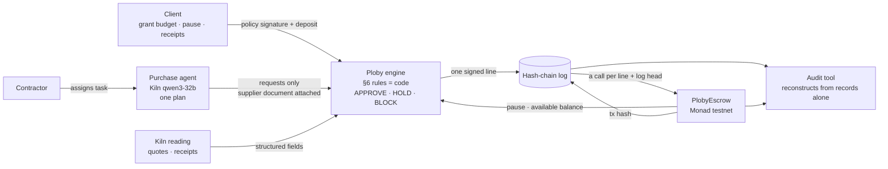
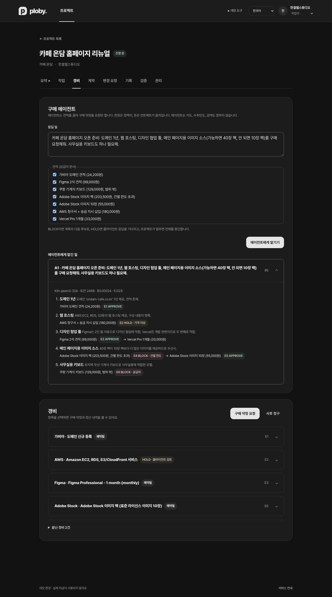
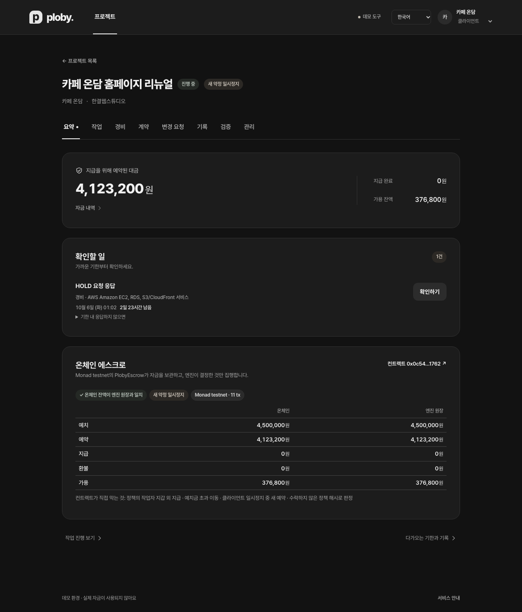
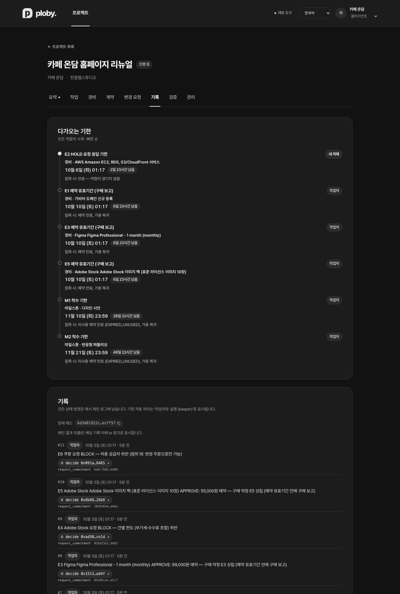
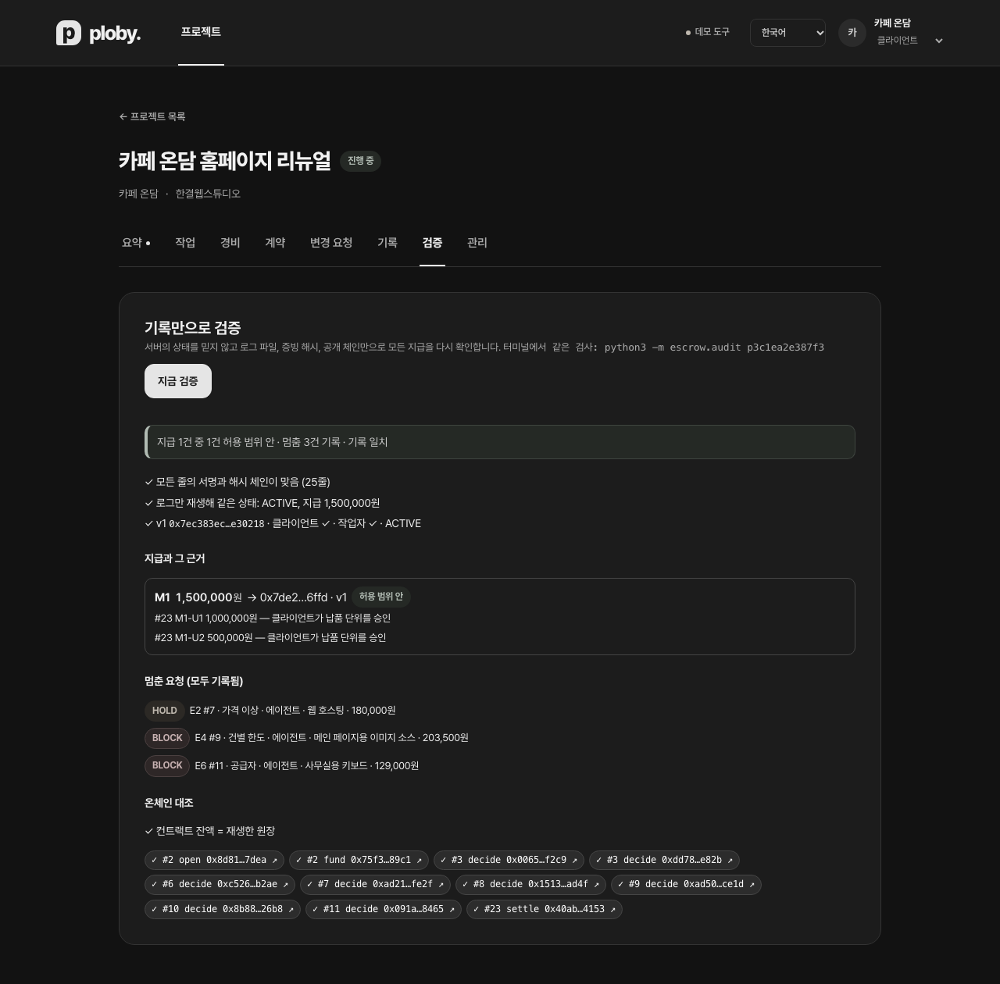

# Ploby

**[Live testnet demo](https://ploby.qucord.com)** · [Deployment and operations](docs/deployment.md)

**Declared function (GWDC Challenge B):** Ploby keeps an AI purchasing agent's spending inside the budget a client funded: the agent can only *request* purchases, code decides each request against a policy both parties signed, a contract on Monad testnet holds and moves the money, and every approval and every stop is recorded so that anyone can reconstruct whether a payment was allowed.

**Reviewers, in two minutes:** [submission evidence](docs/submission.md) — a completed payment and two separate out-of-scope agent runs, each with a recorded stop and public transaction · [demo script](docs/demo.md) · [efficiency](docs/efficiency.md) — committed usage metadata and a matched eight-document benchmark. [Submission files](output/submission/) include the 2:49 captioned video and the editable pitch deck. The filmed demo uses HMAC role signatures: its documents and chain match, but the auditor reports **incomplete human-approval verification**.

> **The AI interprets information; it never has the authority to move money.**

Ploby is a **two-party escrow that secures a freelance project's fees and project expenses up front and pays them out on the terms both sides agreed**. The users are a small café that commissioned a website redesign (the client, Café Ondam) and the web studio doing the work (the contractor, Hangyeol Web Studio). Today, project expenses such as domains, hosting and design tools are either prepaid by the contractor, who may never be reimbursed, or charged to a card the client hands over without knowing what was paid for or why. The project workflow needs to connect the agreed terms, purchase decisions, receipts and transfers in one reviewable record.

## Challenge B at a glance

| Criterion | In Ploby | Evidence |
| --- | --- | --- |
| Declared function & user need | The sentence above. **What the AI does**: the contractor's purchase agent picks among quotes and drafts a purchase plan; reading of quotes and receipts; compiling expense-rule sentences into rules (two independent readings); drafting change orders. **What code does**: every decision (the rules, in §6 order), reserving, paying and refunding money, deadlines and timeouts, the signed hash-chain log, chain calls | [`escrow/agent.py`](escrow/agent.py), [`escrow/ai.py`](escrow/ai.py), [`escrow/expenses.py`](escrow/expenses.py) |
| Boundaries & stopping | Boundary = the policy both parties signed (allowed suppliers and categories, per-item limit **including VAT and fees**, expense budget, period, available balance, client pause). Enforced in two places: ① before reserving money, the engine applies the rules to the supplier's own document, not to what the agent says ② the contract pays only the contractor wallet named in the policy, cannot exceed the deposit, and allows no new reservations while paused. Stops are recorded too, as BLOCK/HOLD decisions in the log and on chain | [`docs/evidence.md`](docs/evidence.md): five runs pushed outside the boundary (over the limit because of VAT, unlisted supplier, injected invoice, client pause, period expired), each with log line + tx. The agent BLOCKed over VAT moves to the next candidate in its plan (a 10-pack) and gets APPROVE |
| Kiln integration & efficiency | Kiln `qwen3-32b` (the team confirmed qwen3-32b and deepseek-v4.1-flash are accepted). Metered per flow: `agent`, `quote`, `write`/`read`/`reread`, `change`. **How responses drive decisions**: the rules check the supplier, amount and fees the reading returned, and the engine's decision (APPROVE · HOLD · BLOCK) sets the agent's next move (next candidate · wait · stop). Zero LLM calls in payment decisions; rules compiled once per project; one reading per document (exact local replays make no new inference request); one plan per agent task. The committed app usage snapshot has 51 API calls, $0.00619 reported cost and 351 cache replays. The matched eight-document benchmark is reported separately. Energy: 4 RNGD cards × 180 W × latency upper bound, plus a per-token estimate from benchmarks (sources cited) | [`docs/efficiency.md`](docs/efficiency.md), `python3 harness/usage_report.py`, the Kiln generation id table in [`docs/evidence.md`](docs/evidence.md) |
| Blockchain integration | Monad testnet (10143) [PlobyEscrow `0x0c54…1762`](https://testnet.monadvision.com/address/0x0c54143Ba8480c9C041E27C5FDed6e13B2541762) + [tKRW `0xE73a…af58`](https://testnet.monadvision.com/address/0xE73a03D814434987f33f5E2b6b51c1dD8A44af58). Before deciding, the engine **reads the contract's pause state and available balance**, then **records** the decision (decide) and **settles** the money (settle · refund). Every call carries the hash-chain head of its log line, and the tx hash is written back to the log | [`docs/chain.md`](docs/chain.md), [`src/PlobyEscrow.sol`](src/PlobyEscrow.sol), [`evidence/`](evidence) |
| Approval & evidence | The client grants the budget (policy signature + deposit tx), tracks spending (agent tasks, decisions, tx links, on-chain balance vs. ledger), stops the agent (pause tx → the next request is recorded as BLOCK), and gets receipts (settlement records + Verify tab). A third party reconstructs everything from the records alone: `python3 -m escrow.audit` | [`escrow/audit.py`](escrow/audit.py), the **Verify** tab in the UI, [`evidence/audit.txt`](evidence/audit.txt) |



<p>



</p>
<p></p>

To re-check the evidence yourself (no keys, public RPC only):

```bash
python3 -m escrow.audit evidence/projects/pd4466e964c56/log.jsonl --data evidence
```

[`PROJECT_OVERVIEW.md`](PROJECT_OVERVIEW.md) is the first-class reference for the product's purpose, flows, decisions, permissions and accounting, and it is an immutable document that is never edited (it is written in Korean and still calls the product by its earlier name, SmartEscrow). Per its §22, code and tests define current behavior, and this README and [`docs/api.md`](docs/api.md) describe the current implementation. Detailed decisions for the target architecture are in [`docs/adr`](docs/adr/README.md). Below, the **current implementation** and the **target design** are kept apart.

## Current implementation

| Area | Current implementation | Target design (not implemented) |
| --- | --- | --- |
| Policy | Immutable, versioned policy that takes effect only when both parties sign the same policy hash. Expense rules use the PCP rule language (form or sentence → two independent readings → readback) | RFC 8785 + keccak256 and contract-verified EIP-712 approvals (now: sorted JSON + sha256, optional engine-verified EIP-712; HMAC demo default) |
| Work fees | Prefunded, reserved milestones; submission notices; client review deadlines; objections based on acceptance criteria; resolver; payment on silence; non-delivery and start deadlines | On-chain submission notices and deadlines |
| Expenses | Purchase commitment before buying → purchase report → receipt submission notice → settlement; retroactive claims; amounts above the commitment cap go to a change order. **The contractor's purchase agent** plans and submits requests (next candidate on BLOCK, waits on HOLD, stops on pause) | Direct payment to suppliers, foreign currency |
| Decision | Deterministic rules in §6 order (allocation, state, period, payment method, supplier, category, payee, per-item limit, expense/category budget, available balance) → BLOCK; untrusted reading or risk signals (duplicate, split, price anomaly) → HOLD; all pass → APPROVE (reserve). The contract's pause state and available balance are read before deciding, and the stricter side wins | Evidence verification service, invoice allocation registry |
| HOLD | Per type (CLIENT_REVIEW, POLICY_OR_SYSTEM_AMBIGUITY, EVIDENCE_DEFECT, INTEGRITY_RISK, EXCESS_AMOUNT): client deadline, dispute-resolution deadline, final fallback outcome; timeouts anyone can execute | Permissionless timeouts on chain time |
| Lifecycle | DRAFT → ACTIVE → CLOSING → CLOSED / CANCELLED, pause on new commitments, refund of the unreserved balance | Security freeze, RECOVERY_ONLY, migration |
| Records | Every change is one line in a signed hash-chain log; the same state replays from the log alone. Original evidence is stored outside the log, with only hashes and manifest hashes in it. Each chain call leaves the log head on chain | Encrypted evidence store |
| Enforcement | **Monad testnet `PlobyEscrow`**: deposits, reservations, payments and refunds are executed on chain, and APPROVE · HOLD · BLOCK decisions are recorded. The decision itself is made by the off-chain engine | A per-project immutable `ProjectEscrow` that enforces the decision too |
| AI | Kiln `qwen3-32b`: purchase plans (agent), expense-rule sentences, reading of quotes and receipts, change order drafts. On failure the result is HOLD or no plan, never an automatic approval. The model's reasoning is not stored | — |
| Audit | Original-document hashes, authorization scope, replay, payment grounds and public-chain checks; explicit verified/incomplete/failed verdict; project ZIP with standalone verifier | Vendor-authenticated evidence |
| UI | Korean/English role spaces, purchase agent, on-chain balance, **Verify** and evidence export; optional browser-wallet action approvals | Production identity and account management |

`src/ExpenseEscrow.sol` is a legacy prototype for Base Sepolia that remains in the repository but is **not connected to the current app.** The app uses `src/PlobyEscrow.sol`. Both contracts are testnet-only and must not be used with real funds ([`DECISIONS.md`](DECISIONS.md)).

## Run it

Requirements: Python 3 (standard-library demo; `pip install -r requirements.txt` for optional wallet approvals), Node.js 20.19+ or 22.12+ with npm, and optionally a Kiln API key and Foundry (`cast` for chain writes).

```shell
cp .env.example .env            # with KILN_API_KEY, readings are real; without it, readings become HOLD. Add chain keys to mirror on chain
python3 -m escrow.server        # run from the repository root. API: http://127.0.0.1:3010/api  (data: var/)
cd frontend && npm ci && npm run dev        # UI: http://localhost:5173  (proxies /api to 3010)
```

At the top right of the UI you switch between Korean and English and between the client, contractor and resolver spaces. The chosen language is saved in the browser. The detail view is split into Overview, Tasks, Expenses, Contract, Change requests, Records, Verify and Admin. The overview shows reserved fees, what needs attention first, and the on-chain balance compared with the engine ledger. The contractor assigns tasks to the purchase agent in the **Expenses** tab, and the client sees in the same tab what the agent requested and what the rules answered. Open **Demo tools** to move time forward with the demo clock; the final fallback outcomes of passed deadlines are applied. A new project is created in four steps: basics → expense rules → tasks and fees → review and create. For visual and interaction rules, see the [design system](docs/design-system.md). Sample documents (quotes, receipts, deliverables) are in `escrow/quotes/` and `escrow/samples/`. The three-minute demo script is in [`docs/demo.md`](docs/demo.md).

## Checks

```shell
python3 harness/check.py        # 64 offline checks: PROJECT_OVERVIEW principles, the agent, the audit and contract rules (Python model), with no model or network
python3 -m unittest harness.test_submission -v  # 8 regression tests; install requirements.txt for wallet checks
python3 harness/benchmark_submission.py --verify evidence/benchmark.json  # offline benchmark replay
python3 harness/fuzz.py         # 200 random projects: whatever the mix of actions, chain calls pass the contract rules and match the ledger
forge test                      # 12 PlobyEscrow tests + legacy contract tests
cd frontend && npm run build    # type check + production build
python3 harness/evidence.py     # challenge evidence runs on Kiln + Monad testnet (docs/evidence.md, evidence/)
python3 -m escrow.audit <project id>   # verify from records alone (var/ or --data)
python3 harness/tamper.py       # tampering demo: points to the edited line; a forgery re-signed with the public demo key is caught by the on-chain log head and amounts
python3 harness/demo_setup.py   # prepare a demo project on a running server (through signing and deposit)
python3 -m pcp spend            # Kiln key spend (shared team budget)
```

## Layout

| Path | Contents |
| --- | --- |
| `pcp/` | Rule language, compiler with two independent readings, readback, decisions, Kiln client (cache, metering, budget guard) |
| `pipeline.json`, `domains/escrow.json` | Per-stage model routing, supplier registry and category reference values |
| `escrow/policy.py` | Policy document, hash, signatures, milestones, final fallback outcome table |
| `escrow/core.py`, `milestones.py`, `expenses.py`, `changes.py`, `engine.py` | State and ledger, milestones, expenses, change orders, keeper and per-role view models |
| `escrow/store.py`, `escrow/server.py` | Log storage and replay, demo clock, evidence store, HTTP API |
| `escrow/ai.py`, `escrow/agent.py` | Kiln reading (expense rules, documents, change order drafts) and the contractor's purchase agent — only model outputs are recorded |
| `escrow/chain.py`, `src/PlobyEscrow.sol`, `src/TestKRW.sol` | Mirror that turns the log into contract calls, and the Monad testnet contracts (`deployments/monad-testnet.json`, `script/deploy_ploby.py`) |
| `escrow/audit.py` | Audit from records alone |
| `frontend/` | React 19 + Vite 7 per-role UI |
| `harness/check.py`, `harness/fuzz.py` | 64 offline checks, chain-mirror checks on random projects |
| `harness/evidence.py`, `harness/tamper.py`, `harness/demo_setup.py`, `harness/usage_report.py` | Challenge evidence runs, tampering demo, demo setup, Kiln usage per flow |
| `evidence/` | Logs, evidence files and audit output from the evidence runs |
| `src/ExpenseEscrow.sol`, `script/Deploy.s.sol` | Legacy Solidity prototype (not connected to the current app) |
| `docs/` | Product, flows, architecture, glossary, ADRs, Kiln, API, chain, efficiency and evidence docs |

## Limits

- Decisions are made by the off-chain engine. The contract enforces how money moves (payee, amount cap, pause) and records decisions, but does not recompute the rules on chain. If the operator key were stolen, it could record decisions outside the policy, but it could not send money to anyone but the contractor or move more than the deposit.
- Default projects use public demo HMAC keys; role switching is not authentication. Optional wallet mode verifies EIP-712 approvals in the engine and independent replay. The deployed contract does not verify these proofs, and testnet funding/operator transactions still use server-held test keys. No production custody claim is made.
- Evidence is accepted as text documents (E1) and stored unencrypted in `var/docs/`. Hashes prove which content was retained, not that a vendor issued it. Missing originals prevent a verified audit verdict.
- The resolver can only reject undelivered units (termination compensation is not implemented).
- The demo assumes the tKRW test token; regulation, custody and security audits are out of scope ([`PROJECT_OVERVIEW.md` §18](PROJECT_OVERVIEW.md#18-현재-한계와-비범위)).
