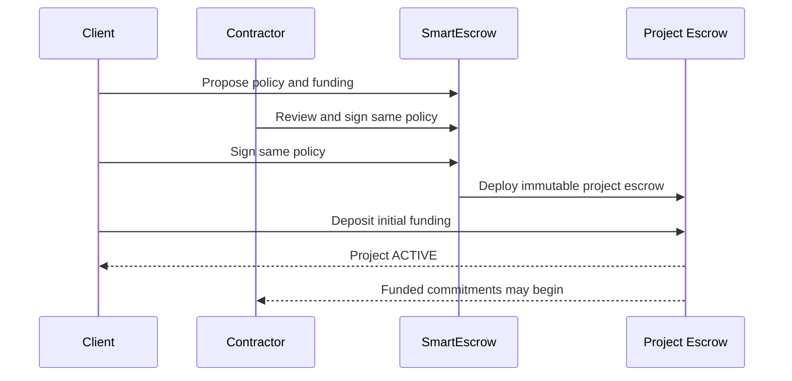
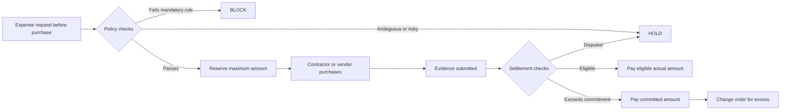

# How SmartEscrow Works

This document explains the target product flow without requiring contract or ADR knowledge.

## 1. Start a project

1. Client and contractor choose one settlement asset, their wallet addresses, a resolver, project budget, expense limits, milestone schedule, evidence requirements, review deadlines, and asset-ownership rules.
2. SmartEscrow creates a canonical policy document.
3. Both parties sign the same policy hash.
4. A dedicated immutable project escrow is deployed at the address predicted in the signed policy.
5. The client deposits the initial required funding.
6. The project becomes ACTIVE only after policy acceptance and funding are both complete.

## 2. Complete a work milestone

1. The milestone amount is fully reserved before the contractor begins.
2. The contractor submits the agreed deliverables and delivery manifest.
3. The client reviews only the criteria defined in advance.
4. Acceptance releases payment immediately.
5. A reasoned objection goes to the resolver.
6. Silence releases eligible submitted units when the review deadline passes.

The client cannot add new acceptance criteria after delivery. Partial payment is possible only for deliverable units and amounts agreed before work began.

Each milestone also has a start-by time, delivery deadline, and grace period. Failure to start releases an unused reservation. Failure to submit by the end of the grace period enters a bounded non-delivery review instead of locking funds indefinitely.

## 3. Reserve and settle an expense

The reservation protects both sides. The contractor knows the committed amount is funded, and the client knows it cannot exceed the agreed cap or go to another payee.

## 4. Resolve HOLD

Every HOLD identifies its class, deadline, and fallback before either party signs the project policy.

| HOLD | What happens if the client is silent? | Final fallback |
| --- | --- | --- |
| Business review with no objective failure | Pay the committed eligible amount | Payment |
| System or policy ambiguity with valid evidence and known amount | Send to resolver | Payment if resolver is also silent |
| Missing or insufficient evidence | Send to resolver | Rejection if not cured |
| Signature, allocation, or supported integrity failure | Send to resolver | Rejection |
| Amount above the commitment | Pay committed portion; do not pay excess | Bilateral change order required for excess |

A client objection to a valid commitment is not a final rejection. It moves to the resolver. Timeouts can be triggered by anyone, so the platform backend cannot suppress the outcome by going offline.

## 5. Change project scope

An out-of-scope request does not silently become contractor work.

1. The active request is marked OUT_OF_SCOPE.
2. AI may draft a change order containing deliverables, price, schedule, criteria, and policy changes.
3. Client and contractor review the draft.
4. Both sign the new policy version.
5. The client funds the additional amount.
6. Only then does the new milestone or expense authority become active.

Existing commitments continue under the policy version they originally pinned.

## 6. Share an invoice fairly

A shared subscription may be allocated across projects. The Evidence Attestation Service turns the private normalized invoice identity into the same opaque nullifier for every participating project.

- Project A can reserve 40 percent.
- Project B can reserve 60 percent.
- A later allocation is rejected because the total would exceed 100 percent.

The public registry shows allocation capacity and status, not the vendor, invoice number, client identity, document, or source amount.

## 7. Hand over project assets

Expenses and milestones identify whether they create a client project asset, use a contractor-owned tool, create a shared asset, or are simply consumed.

For a project asset:

1. Ownership, temporary custodian, required transfer evidence, and holdback are agreed in advance.
2. The contractor transfers control through the external provider.
3. The contractor submits the agreed evidence.
4. Client acceptance or resolver attestation releases only the predefined handover holdback.
5. Silence follows the agreed timeout rule.

External account transfer and blockchain payment are not literally one atomic transaction. The blockchain atomically pays against an accepted transfer attestation.

## 8. Pause or close

Client pause stops new commitments but does not stop payment of existing ones. Either party may initiate closing.

During CLOSING:

- no new work or expense commitment is created;
- funded obligations continue to settle or resolve;
- unused reservations expire or are cancelled;
- project assets complete their handover checklist;
- the client may withdraw only unreserved funds;
- the project becomes CLOSED when obligations, disputes, assets, and refunds are complete.

A protocol security freeze is different. It may temporarily stop all transfers during a signer or contract incident, but deadlines are extended and obligations are preserved.
