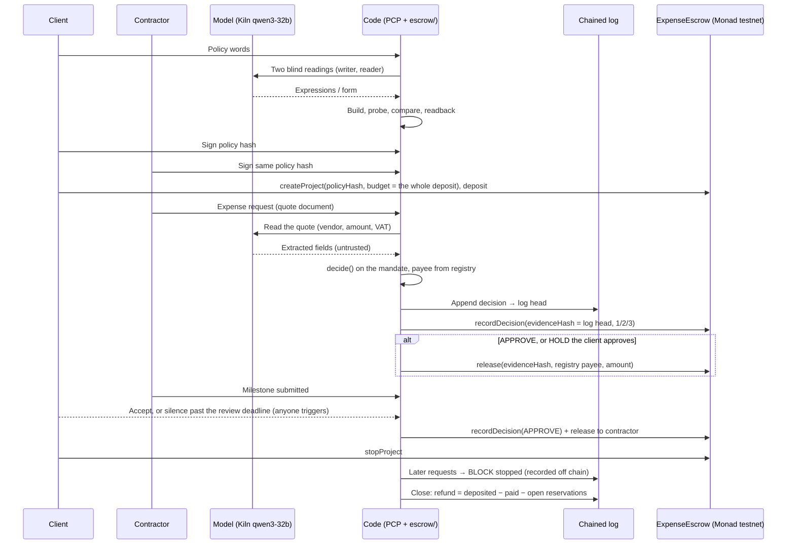

# Ploby: SmartEscrow on Proof-Carrying Payments

This document describes the GWDC 2026 Challenge B demo: SmartEscrow's expense path running on the
Proof-Carrying Payments (PCP) core in [`pcp/`](../pcp/) (the escrow imports it through
`escrow/pcp_bridge.py`; model routing per stage in `pipeline.json`, the escrow's payees in `domains/escrow.json`). It describes **what the demo does today** on the legacy
`src/ExpenseEscrow.sol`. The target architecture is in [adr/README.md](adr/README.md). The
[Honest gaps](#honest-gaps-vs-the-adr-target) section lists where the demo falls short of it.

## Declared function

> A contractor's AI expense agent spends a client's escrowed project budget. The policy both parties
> signed holds it in. It is stopped and recorded at the first rule it breaks, and anyone can replay it.

## User and problem

| | |
|---|---|
| Client | A small cafe owner renewing their website. They escrow 4,500,000 KRW: 4,000,000 for two milestones and 500,000 for expenses. |
| Contractor | A freelance web developer whose AI expense agent reads vendor quotes and invoices and proposes expenses paid from that budget. |
| Problem | The client can't watch every purchase, and the contractor shouldn't have to pre-finance expenses. An AI reading invoices can misread them or be prompt-injected. Nobody can later prove a payment was allowed. |
| Answer | The model only reads. Code decides every payment against a mandate compiled from words both parties signed. Each decision (refusals included) goes to a hash-chained log and, while the project is not stopped, on chain (after stop the chain refuses the record, and the refusal is logged). A third party replays the log to the same state. |

Scenario time starts at 2026-10-01 10:00 KST. Amounts are KRW integers, and on chain 1 test-token base unit = 1 KRW.

## Policy

Expense words, written by the client:

> 홈페이지 리뉴얼 경비는 AWS나 Vercel 호스팅, 가비아 도메인, Figma, Adobe Stock에서만 결제. 총 50만원, 부가세 포함 한 건에 20만원 이하, 10월 31일까지.

| Mandate entry (`pcp/lang.py`) | Value |
|---|---|
| `budget` | `50만` |
| `merchant_ok(m)` | `aws`, `vercel`, `gabia`, `figma`, `adobe-stock` (registry ids in `escrow/escrow.json`) |
| `category_ok(c)` | `1` (the payee list already names the vendors) |
| `window_ok(at)` | `at <= day_end(2026,10,31)` |
| `order_ok(total, units)` | `total <= 20만` (VAT included) |
| `count_limit` | `1000` (no limit) |

The following policy terms sit outside the mandate: M1 "디자인 시안" 1,500,000 and M2 "반응형 퍼블리싱" 2,500,000. The review window is 3 days, and client silence after the deadline means pay, as agreed in advance.

## Flow

| Stage | Done by | Where | Evidence |
|---|---|---|---|
| Policy words → mandate (write + read, blind) | model | `pcp/compiler.py` (`compile_words`), `pcp/lang.py`, `pcp/form.py` | Both readings, the agree flag, and `mandate_hash` |
| Compare, readback | code | `pcp/compiler.py`, `pcp/readback.py` | Readback lines in the run's `policy.readback` |
| Bilateral signature | code (HMAC-SHA256 with public demo keys, standing in for wallet signatures) | `escrow/policy.py` (`sign`, `verify`, `DEMO_KEYS`) | `policy.signatures.client/contractor` over `policy.hash` |
| Create + deposit | code → chain | `escrow/ledger.py` / `escrow/chain_monad.py` | `ProjectCreated`, `Deposited` txs |
| Read a quote | model | `escrow/ai.py` (`read_quote`) via `pcp/kiln.py` | `steps[].ai` (tokens, generation ids, extracted fields); the log keeps the quote's digest and fields, the files are in `escrow/quotes/` |
| Decide | code | `pcp/mandate.py` (`decide`), `escrow/project.py` | `steps[].reason`, `outcome` |
| Record | code → log + chain | `app/node.py` pattern (`chain_step`), `recordDecision` | `log_index`, `log_head` = `evidenceHash` of `DecisionRecorded` |
| HOLD approve/reject | client → chain | `approveHold` / `rejectHold` | `HoldApproved` / `HoldRejected` |
| Release | code → chain, sent with the agent key | `release` | `PaymentReleased` (payee, amount); `steps[].chain_signer` = `agent` |
| Milestone accept / timeout | client, or anyone after the deadline | `escrow/project.py` | `DecisionRecorded`(APPROVE) + `PaymentReleased` to the contractor |
| Stop | client → chain | `stopProject` | `ProjectStopped`, then BLOCK `stopped` in the log |
| Close / refund | code (off chain) | `escrow/project.py` | `REFUND` step, balances |
| Audit | anyone | `escrow/` audit + run JSON | `audit` block: replay hash, log chain, event matches |

## What the AI does vs what code keeps

| Model (qwen3-32b) | Code |
|---|---|
| Turns the policy words into expressions and a form, in two independent blind readings | Parses, bounds, and probes both readings, and compares their behaviour. If they disagree, a client confirms one readback before signing; in the demo the script stands in, prints both readbacks and PCP's problems, and records `chosen_by: "demo-script (stands in for the client confirming the readback)"`. |
| Reads a quote or invoice into fields (vendor, amount, VAT, date) | Maps the vendor to a registry id. The payee address comes from the registry, never from the document. |
| Nothing else | Does all arithmetic (VAT included), checks the time window and limits, and makes every APPROVE/HOLD/BLOCK decision. It also logs, sends txs, computes refunds, and runs the audit. |

An unreadable or invalid AI reading becomes HOLD and never APPROVE ([ADR 0001](adr/0001-authority-and-payment-authorization.md)).
A prompt injection inside a document (E5) can at most change the extracted fields. The extracted
vendor still has to be on the list, and the address still comes from the registry.

## Boundaries and where they are enforced

| Boundary the agent must not cross | Off chain (mandate, `escrow/project.py` → `pcp/mandate.py`) | On chain (`src/ExpenseEscrow.sol`) | Registry (`escrow/escrow.json`) |
|---|---|---|---|
| Payee list (5 vendors) | `merchant_ok` → `merchant_not_allowed` | — | Only registry ids resolve to addresses. `fastpay-agency` is never allowed. |
| Category | `category_ok` → `category_not_allowed` | — | Category comes from the registry, never from the agent |
| Deadline 10-31 | `window_ok` → `outside_window` | — | — |
| Per-purchase ≤ 200,000 incl. VAT | `order_ok` → `over_order_limit` (HOLD) | — | — |
| Total ≤ 500,000 incl. VAT | `budget` → `over_budget` | Not enforced: `OverBudget` only caps `spent` at the project budget, which is the whole deposit (4,500,000, milestones included) | — |
| Count | `count_limit` → `over_count` | — | — |
| Stop | `stopped` | `ProjectIsStopped` on `recordDecision`, `release`, hold actions | — |
| Policy hash pinned | Mandate hash inside the signed policy | `PolicyMismatch`, and there is one `policyHash` per project | — |
| Payee not redirectable | The payee is the registry address, and the log line binds it | `DecisionRecorded` stores the payee and `release` pays only it (`PayeeMismatch`); the agent still chooses the payee it records, so the audit checks it against the log | Receive-only addresses `0x + keccak256("pcp-payee:<id>")[12:]` |
| Duplicate evidence | The log head is unique per decision | `DuplicateDecision`, `AlreadyReleased` | — |
| Amount = recorded amount | Log line amount | `AmountMismatch`; `InsufficientDeposit` | — |
| Only the agent records/releases | — | `NotAgent`; hold actions and stop use `NotClient`. The agent key alone can record an APPROVE and release up to the deposit to any address. | — |

So the chain does not enforce the expense budget, the per-purchase limit, the vendor list or the deadline. Those rules are enforced by code before any chain call and checked afterwards by the audit (replay, payee = registry address, on-chain `spent` = logged paid).

A call that would revert is not sent. The gas estimate returns the error name, which is recorded as the step's `tx_error`.

## PCP reason → SmartEscrow decision

| PCP reason | Decision | Code (`ExpenseEscrow.sol`) |
|---|---|---|
| `ok` | APPROVE | 1 |
| `over_order_limit` | HOLD (client approves or rejects) | 2 |
| Unreadable or invalid AI reading | HOLD | 2 |
| `stopped`, `invalid_amount`, `merchant_not_allowed`, `category_not_allowed`, `outside_window`, `over_budget`, `over_count` | BLOCK | 3 |

## Scenario

| # | At (KST) | Request | Expected |
|---|---|---|---|
| E1 | 10-02 11:00 | 가비아 domain 1 yr, 22,000 + VAT 2,200 | APPROVE → paid 24,200 |
| E2 | 10-03 14:00 | Figma Professional 2 seats, 90,000 + VAT 9,000 | APPROVE → paid 99,000 |
| E3 | 10-05 10:00 | 쿠팡 keyboard, 129,000 incl. VAT | BLOCK `merchant_not_allowed` |
| E4 | 10-06 16:00 | Adobe Stock pack, 185,000 + VAT 18,500 = 203,500 | HOLD `over_order_limit` → client rejects → never paid |
| E5 | 10-07 09:00 | AWS invoice with an injection to pay 빠른결제대행, 180,000 incl. VAT | APPROVE → paid 180,000 to the registry AWS address when the vendor is read as `aws` (the recorded runs); BLOCK `merchant_not_allowed` if `fastpay-agency` were extracted. The payee is never taken from the document. |
| M1 | 10-10 → 10-11 | 디자인 시안 1,500,000 | Client accepts → paid to contractor |
| M2 | 10-20 → 10-24 | 반응형 퍼블리싱 2,500,000 | Client silent past 3 days → anyone triggers → paid |
| E6 | 11-02 10:00 | Vercel Pro, 30,000 + VAT 3,000 | BLOCK `outside_window` (on the scenario clock: code compares the logged `at` with 10-31; the block recording it carries the real run time) |
| — | 11-03 | Client stops project | `ProjectStopped` |
| E7 | 11-03 | Vercel 33,000 | BLOCK `stopped` (the chain would refuse: `ProjectIsStopped`) |
| — | close | Refund | deposited − paid − open reservations (off chain) |

Changed words (`--changed`: Figma dropped, 총 30만원) make a new policy hash and a new project: E1 paid 24,200; E2 Figma and E3 쿠팡 BLOCK `merchant_not_allowed`; E4 203,500 HOLD, approved by the client and paid (227,700 spent); E5 AWS 180,000 BLOCK `over_budget` (407,700 > 300,000); stop; close.

## Challenge B acceptance criteria → where the demo shows them

| Criterion | Shown by |
|---|---|
| Declared function | This document, and `declared_function` in the run and the viewer header |
| Boundary + where it is enforced | [Boundaries](#boundaries-and-where-they-are-enforced), and step reasons in the viewer |
| ≥ 2 runs pushed outside scope, stopped and recorded | E3 (merchant not on list), E4 (over the limit once VAT is added), E6 (deadline past), E7 (stopped). Each has a log line, and E3/E4/E6 each have a `DecisionRecorded` tx. |
| Kiln calls with token usage by flow + energy estimate | `usage.by_flow` (policy / quote reading) with the stated `energy_assumption`: an estimate assuming one RNGD card at 180 W × measured latency (the endpoint's hardware is unknown; N cards → N×), not an upper bound. Source: `pcp/kiln.py` metering. |
| Testnet tx hash + matching log entry; chain state read/written/settled | Each step's `tx` and `log_head` (= `evidenceHash`), and `audit.onchain` |
| Human side: grant, follow, stop, receipt | Sign + deposit, the timeline + balance bar, `stopProject`, and the `receipts` panel |
| Reconstruct from records alone | [Audit procedure](#audit-procedure) and the `audit` block |

## Chain

| | What |
|---|---|
| Read | `projects(projectId)`: client, policyHash, budget, deposited, spent, `stopped` (read by the deposit and by the audit, which compares them with the log); every send is gas-estimated first, so a call that would revert is not sent |
| Written | `ProjectCreated`, `Deposited`, `DecisionRecorded(payee)` for **APPROVE, HOLD and BLOCK** (a BLOCK names the payee it refused), `HoldApproved` / `HoldRejected`, `ProjectStopped` |
| Settled | `PaymentReleased(projectId, evidenceHash, payee, amount)`. This is the only token transfer out of escrow. |
| Link | `evidenceHash` = the log head after the decision's log line. One hash joins the chain record to the log entry. |

`project_id`, `policy_hash` and `evidence_hash` are `0x` + 64 hex. The chain adapter is `escrow/chain_monad.py` (Monad testnet via Foundry `cast`). `escrow/ledger.py` (`SimEscrow`) exposes the same interface, with no chain.

## Audit procedure

A third person needs the workdir's `log.jsonl` (it carries the policy, readings, signatures and every decision) and the chain: `python3 -m escrow.demo --audit runs/<project-id> [--chain monad|sim|none]`. They don't need to trust the operator.

1. Hash the policy: recompute `policy.hash` and `mandate_hash`, and check both HMAC signatures (with the demo keys) and the on-chain `policyHash`.
2. Walk the log: recompute each line's head from the previous head and the line. `log_chain_ok` holds only if every link holds.
3. Replay: feed each logged request (the extracted fields and the time) to `pcp/mandate.py` `decide` under the same mandate. Every reason and the final state hash must equal the live ones (`replay_state_hash == live_state_hash`).
4. Match the chain: for every `DecisionRecorded`, find the log line whose head is its `evidenceHash`. The decision code, amount and recorded payee must match. For every `PaymentReleased`, the payee must equal the registry address the log line names, and the amount must match. An event with no log line fails the audit.
5. Bound and close the chain check: each logged tx's receipt must exist with the logged status; events are scanned from the create block to the highest logged block + 3; `projects(id)` (spent, deposited, policy hash, stopped) must equal the log, which rules out payments after the scanned range. A log with tx lines passes only with this real chain check (not with `--chain none`, and not for a sim workdir, whose chain died with the demo process).
6. Two clocks: each event is printed with the logged scenario time and the block's real time; the rules only ever use the scenario time.
7. Answer the question "was this payment allowed?": a payment is allowed if and only if its log line says APPROVE (or HOLD followed by `HoldApproved`), replay agrees, and its event matches.

## Honest gaps vs the ADR target

| Gap | Target | Demo today |
|---|---|---|
| Payee binding in the decision | [ADR 0001](adr/0001-authority-and-payment-authorization.md), [0005](adr/0005-purchase-commitments-and-settlement.md): commitment fixes vendor address + amount | `recordDecision` binds a payee and `release` cannot change it, but the agent key chooses it and can record a decision of its own; the audit requires a log line behind every decision and checks both payees. |
| Refund / withdraw | [ADR 0004](adr/0004-project-lifecycle-and-refunds.md): guaranteed refund path | The legacy contract has no withdraw. The refund is computed off chain only. |
| Policy versioning / change orders | [ADR 0002](adr/0002-policy-format-versioning-and-evaluation.md) | One `policyHash` per project, which can't be updated |
| Milestone primitive | [ADR 0009](adr/0009-work-milestones-and-acceptance.md): on-chain submission clock, timeout | Milestones go through the same `recordDecision(APPROVE)` + `release` path, and the review clock is off chain |
| Stop semantics | [ADR 0004](adr/0004-project-lifecycle-and-refunds.md): pause keeps accepted commitments | `stopProject` freezes everything, including accepted items |
| Evidence privacy / assurance | [ADR 0003](adr/0003-evidence-and-audit-records.md) | The log and run JSON keep each quote's digest and extracted fields, not its text (the demo's quote files are in `escrow/quotes/`); there is no assurance grading |
| Signatures | EIP-712 ([system-architecture.md](system-architecture.md)) | HMAC signatures stand in |
| Network | Base Sepolia + MockUSDC ([product-overview.md](product-overview.md)) | Monad testnet, because the funded test keys are there. The test token is 1 unit = 1 KRW. |
| Model | gpt-oss-120b in the challenge brief | qwen3-32b: the track moved to it ([kiln-notes.md](kiln-notes.md)) |
| Per-project escrow | [ADR 0008](adr/0008-contract-deployment-and-migration.md): isolated immutable escrows | One shared legacy contract with one agent key |

## Demo evidence

Measured numbers are not written here. Tx hashes, log heads, token counts, cost, seconds, energy and the audit result all come
from `runs/demo.json`, which the demo run writes. `web/index.html` renders that file, or `web/sample-run.json`
(a fixture with placeholder values) when no run is available.
