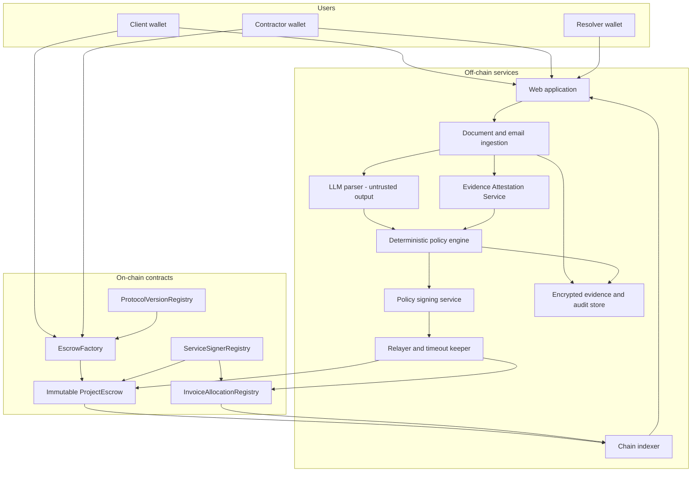

# System Architecture

## Architecture at a glance

## Trust boundaries

### Untrusted inputs

- Uploaded documents, images, email content, natural-language requests, and LLM output are untrusted.
- The LLM cannot sign, submit, approve, resolve, or release a transaction.
- Browser state and indexed database views are not financial authority.

### Trusted but constrained MVP services

- The policy signer may sign only schema-valid deterministic evaluation results.
- The resolver may decide only a disputed amount under predefined criteria.
- The Evidence Attestation Service may normalize invoices and issue evidence attestations.
- The administrator multisig may rotate service keys and apply a bounded security freeze.

None of these roles may redirect a payee, exceed a commitment cap, rewrite policy, or withdraw escrowed funds.

### On-chain enforcement

The `ProjectEscrow` enforces:

- participant and service signatures;
- policy version and commitment identity;
- exact asset, payee, amount cap, and nonce;
- funded, reserved, released, and refundable accounting;
- project lifecycle and bounded freeze state;
- client and resolver deadlines;
- replay protection;
- milestone and expense settlement;
- close and refund conditions.

The allocation registry atomically enforces that active and settled allocations for one invoice nullifier do not exceed 100 percent.

## Project isolation

Every project has a separate immutable escrow contract and token balance. A defect or accounting error in one project cannot consume another project's funds.

Shared contracts hold no project funds. New logic is deployed as a new immutable version. Existing projects continue on their original version unless client and contractor sign a migration intent.

## Core data artifacts

| Artifact | Location | Purpose |
| --- | --- | --- |
| Project policy | Encrypted store; hash and acceptance on-chain | Bilateral rules and budget |
| Purchase commitment | On-chain typed digest and state; full bundle off-chain | Pre-spend expense assurance |
| Milestone commitment | On-chain typed digest and state; full bundle off-chain | Pre-funded work payment |
| Evidence manifest | Encrypted store; hash on-chain | Integrity of submitted evidence |
| Decision bundle | Encrypted store; hash on-chain | Reproducible rules, reasons, versions, and outcome |
| Asset register | Encrypted store; checkpoint hash on-chain | Ownership, custody, recurring cost, and handover |
| Invoice allocation | Opaque nullifier and basis points on-chain | Cross-project over-claim prevention |

Sensitive documents, invoice identifiers, account credentials, emails, and personal data remain off-chain.

## Transaction and liveness model

- Financial signatures use EIP-712; smart-account signatures use EIP-1271.
- The platform relayer normally submits transactions and pays gas.
- Any account may submit a valid signed payload or call a permissionless timeout transition.
- Deadlines use chain time, not backend or browser clocks.
- The UI distinguishes submitted, confirmed, and finalized transactions.
- The indexer can be rebuilt from chain events and stored canonical artifacts.

## Failure behavior

| Failure | Required behavior |
| --- | --- |
| LLM unavailable or malformed output | HOLD or no decision; never approve |
| Policy engine unavailable after valid evidence and known amount | Timed resolver path; commitment preserved |
| Relayer unavailable | User or another relayer submits signed payload or timeout |
| Policy signer compromised | Rotate key, apply bounded security freeze, preserve obligations |
| Resolver unavailable | Apply the pre-agreed resolver-timeout result |
| Evidence store unavailable | No new evidence-dependent approval; on-chain funds remain reserved |
| Indexer unavailable | UI degrades; contract state remains authoritative |
| Token transfer fails | State and accounting remain unchanged |
| Contract defect | Bounded freeze, publish fixed version, bilateral migration |

## Current implementation gap

The current repository contains an initial multi-project Solidity escrow. It does not yet implement per-project deployment, reservations, milestones, deadline execution, refunds, asset handover, allocation registry, or bilateral migration. The ADRs and this document describe the target architecture for later implementation.
